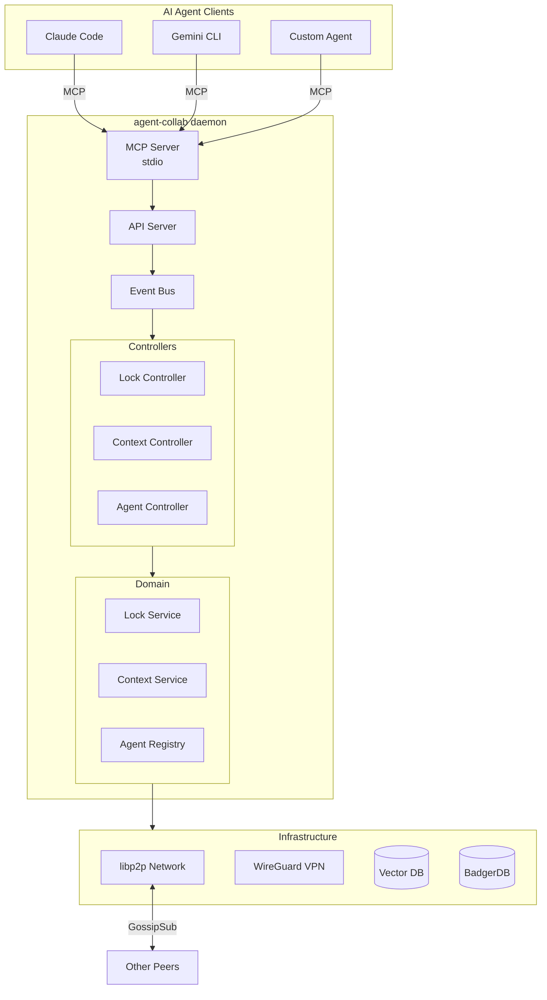
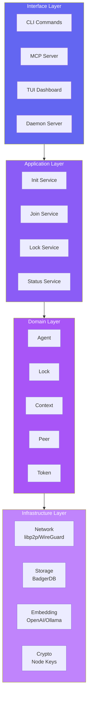
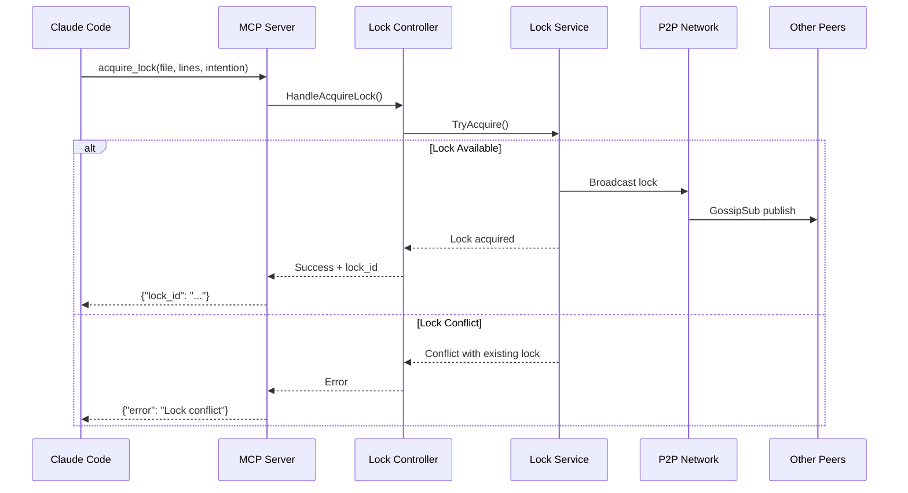
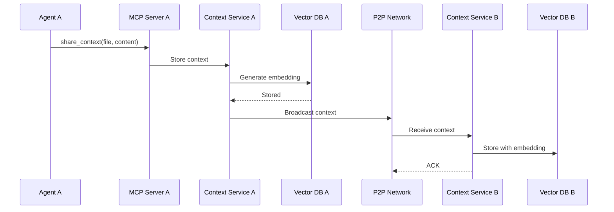
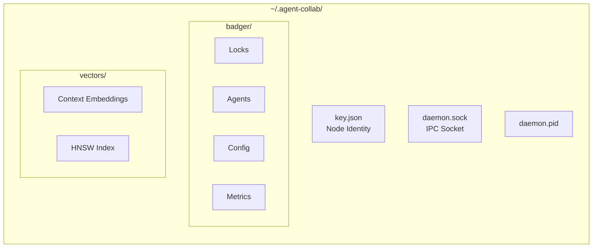
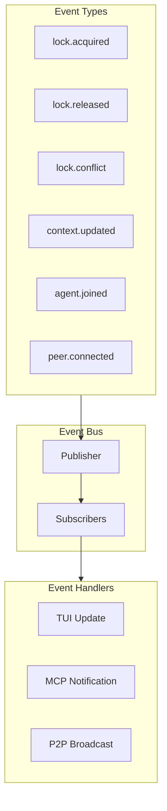
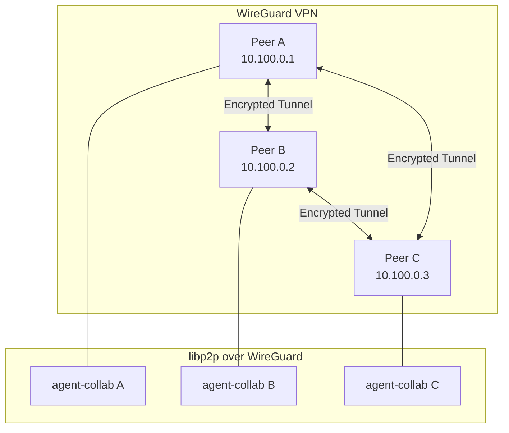
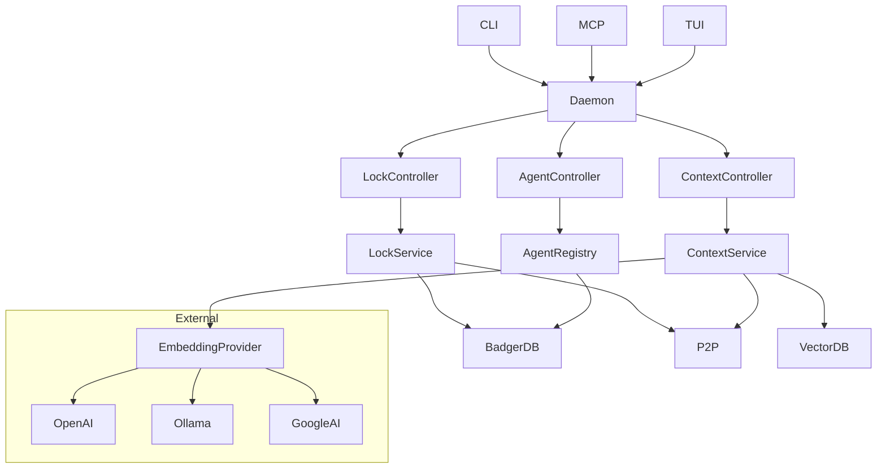

# Architecture

Understanding how agent-collab works under the hood.

## System Overview



## Layered Architecture

agent-collab follows a clean architecture pattern:



### Layer Responsibilities

| Layer | Responsibility | Examples |
|-------|---------------|----------|
| **Interface** | User interaction | CLI, MCP Server, TUI |
| **Application** | Use case orchestration | Init cluster, Join cluster |
| **Domain** | Business logic | Lock management, Context sync |
| **Infrastructure** | Technical details | P2P networking, Database |

## P2P Network

agent-collab uses [libp2p](https://libp2p.io/) for peer-to-peer communication:

```mermaid
flowchart LR
    subgraph Cluster["agent-collab Cluster"]
        P1[Peer A<br/>12D3Koo...]
        P2[Peer B<br/>12D3Koo...]
        P3[Peer C<br/>12D3Koo...]
    end

    P1 <-->|GossipSub| P2
    P2 <-->|GossipSub| P3
    P3 <-->|GossipSub| P1

    subgraph Topics["PubSub Topics"]
        T1[/agent-collab/locks]
        T2[/agent-collab/context]
        T3[/agent-collab/events]
    end
```

### Key Components

- **GossipSub**: Efficient message propagation across peers
- **DHT**: Distributed hash table for peer discovery
- **mDNS**: Local network peer discovery
- **NAT Traversal**: Automatic hole punching for firewalled networks

## Data Flow

### Lock Acquisition Flow



### Context Sharing Flow



## Storage Architecture



### Data Stores

| Store | Purpose | Technology |
|-------|---------|------------|
| **BadgerDB** | Persistent key-value storage | Embedded Go database |
| **Vector DB** | Semantic search | HNSW index with embeddings |
| **IPC Socket** | Daemon communication | Unix domain socket |

## Event System



## WireGuard Integration (Optional)

For secure, encrypted communication:



Enable WireGuard with:

```bash
agent-collab init -p my-project --wireguard
```

## Component Dependencies


