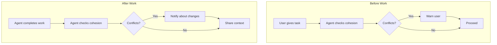
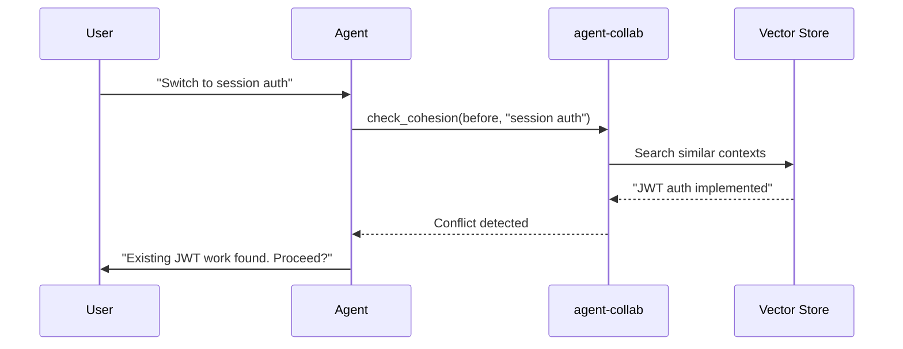
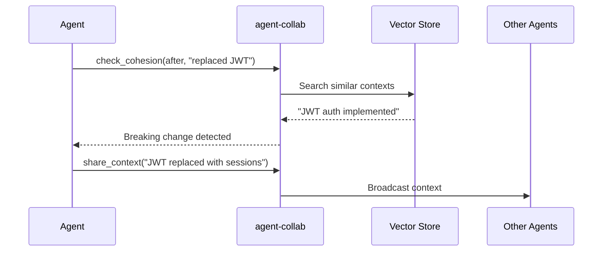
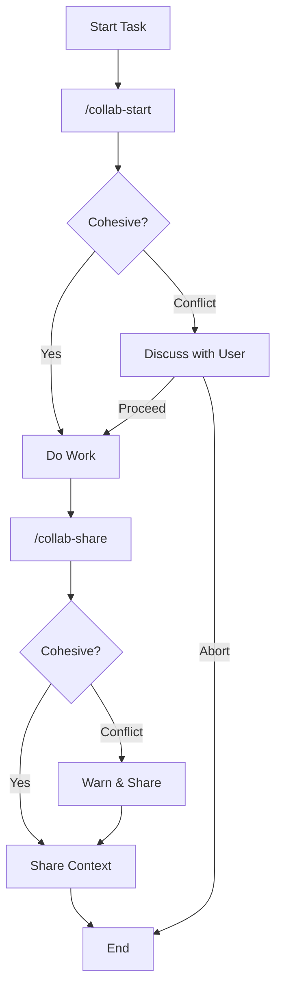

# Cohesion Checking

How agents verify their work aligns with team context.

## What is Cohesion?

Cohesion checking ensures that an agent's intended work or completed result aligns with existing team context. It helps prevent conflicting changes when multiple agents work on the same codebase.



## Why Check Cohesion?

### Scenario: Conflicting Approaches

```
Agent A (Seoul): "Implemented JWT authentication"
Agent B (US): User asks "Switch to session-based auth"

Without cohesion check:
→ Agent B implements sessions
→ Conflicts with Agent A's JWT work
→ Inconsistent codebase

With cohesion check:
→ Agent B detects existing JWT context
→ Warns user about potential conflict
→ User decides how to proceed
```

## How It Works

### Before Check

When starting work, the agent checks if their intention conflicts with existing context:



### After Check

After completing work, the agent verifies the result aligns with team decisions:



## Using check_cohesion

### MCP Tool

```json
// Before check
{
  "tool": "check_cohesion",
  "arguments": {
    "type": "before",
    "intention": "Implement session-based authentication"
  }
}

// After check
{
  "tool": "check_cohesion",
  "arguments": {
    "type": "after",
    "result": "Replaced JWT with session cookies",
    "files_changed": ["auth/handler.go", "auth/session.go"]
  }
}
```

### Response Format

```json
{
  "verdict": "conflict",
  "confidence": 0.85,
  "related_contexts": [
    {
      "id": "ctx-abc123",
      "agent": "Agent-A",
      "file_path": "auth/handler.go",
      "content": "Implemented JWT-based authentication",
      "similarity": 0.89
    }
  ],
  "potential_conflicts": [
    {
      "context": { ... },
      "reason": "Conflicting authentication approach",
      "severity": "high"
    }
  ],
  "suggestions": [
    "Review the related contexts before proceeding",
    "Consider discussing with the team",
    "Share context after completing work"
  ],
  "message": "Potential conflict detected with 1 existing context(s)"
}
```

## Verdict Types

| Verdict | Meaning | Action |
|---------|---------|--------|
| `cohesive` | Work aligns with existing context | Safe to proceed |
| `conflict` | Potential conflict detected | Review and confirm with user |
| `uncertain` | Unable to determine | Proceed with caution |

## Conflict Detection

### Conflict Indicators

Words that suggest potential conflicts:
- "instead", "replace", "remove", "switch to"
- "migrate", "deprecated", "no longer"
- Korean: "대신", "변경", "제거", "전환"

### Opposing Patterns

Automatically detected conflicts:
- JWT ↔ Session (authentication approach)
- REST ↔ GraphQL (API style)
- SQL ↔ NoSQL (database approach)
- Monolith ↔ Microservice (architecture)
- Sync ↔ Async (execution model)

## Best Practices

### 1. Check Before Starting

```
/collab-start implement new auth system
```

Always check cohesion before significant work.

### 2. Be Specific

Good:
```
"Switch authentication from JWT to session-based with Redis storage"
```

Bad:
```
"Change auth"
```

### 3. Share After Changes

Even if no conflict was detected, share context:
```
/collab-share auth/handler.go Replaced JWT with sessions, Redis for session storage
```

### 4. Respect Conflicts

When a conflict is detected:
1. Review the existing context
2. Discuss with user if this is intentional
3. If proceeding, share context to inform others

## Integration with Workflow



## Technical Details

### Similarity Thresholds

| Threshold | Value | Meaning |
|-----------|-------|---------|
| High | 0.85 | Strong relevance |
| Medium | 0.70 | Moderate relevance |
| Low | 0.55 | Weak relevance |

### Conflict Severity

| Severity | Trigger |
|----------|---------|
| High | High similarity + conflict indicators |
| Medium | Opposing patterns detected |
| Low | Related context in same area |

## Examples

### Example 1: Safe to Proceed

```
Intention: "Add JWT refresh token support"
Existing: "JWT authentication implemented"

Result: cohesive
Message: "Your work aligns with existing context"
```

### Example 2: Conflict Detected

```
Intention: "Switch to GraphQL API"
Existing: "REST API with JSON responses"

Result: conflict
Reason: "Conflicting API style"
Severity: high
```

### Example 3: Direction Change

```
Intention: "Migrate from SQL to MongoDB"
Existing: "PostgreSQL schema with foreign keys"

Result: conflict
Suggestions:
- "This is a significant architecture change"
- "Ensure team alignment before proceeding"
```
