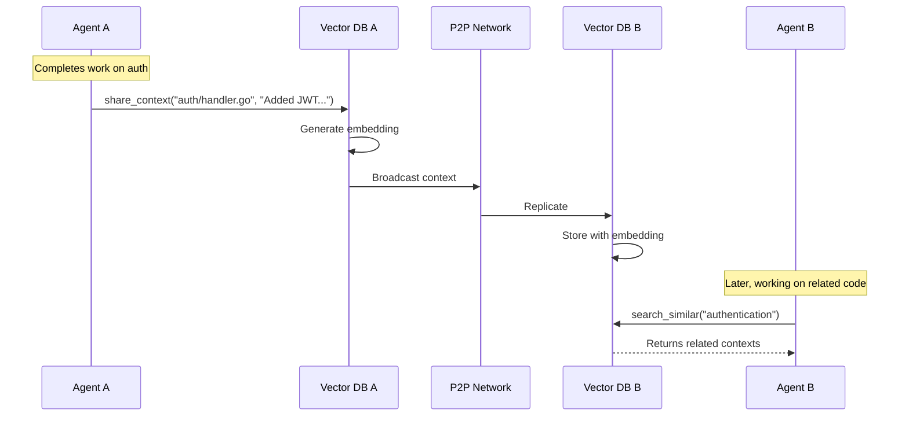
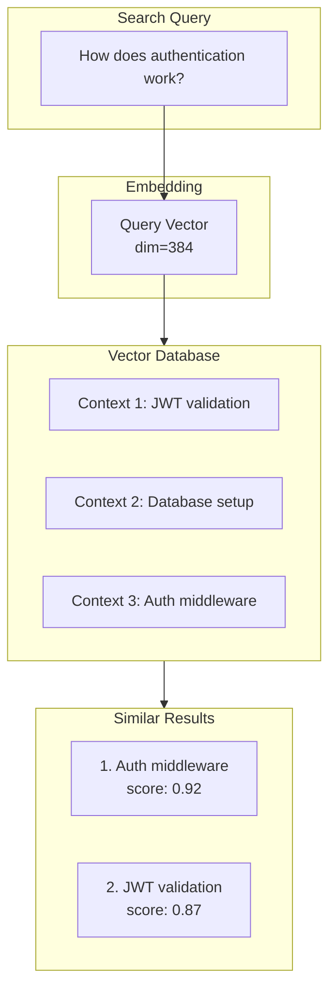
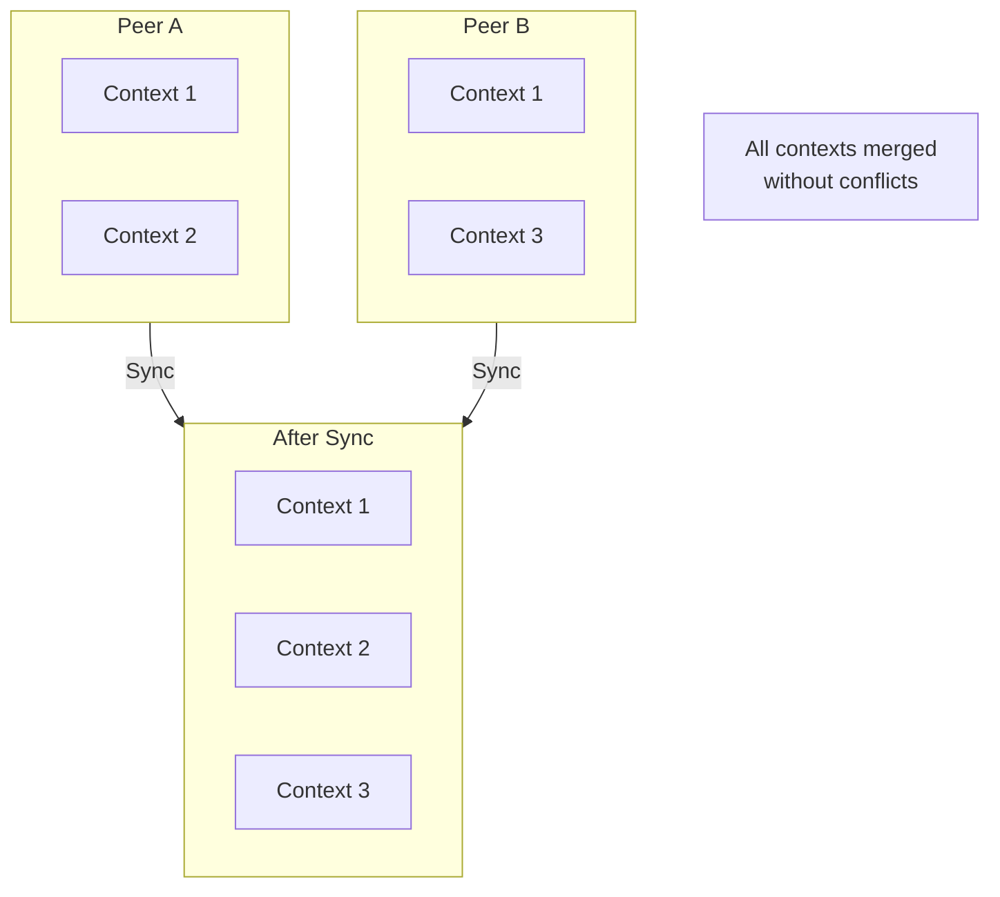
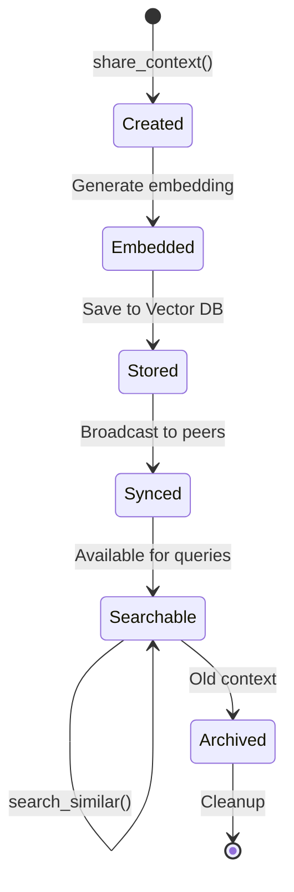
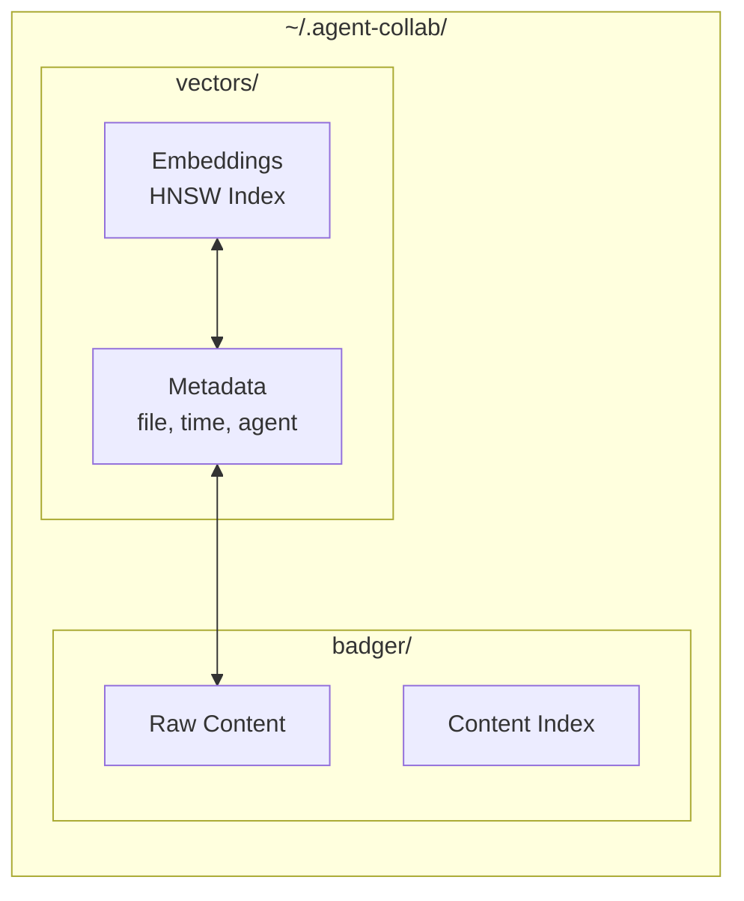
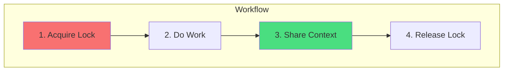

# Context Sharing

How agents share knowledge and stay synchronized.

## What is Context?

Context is knowledge that agents share with each other:

- What changes were made to a file
- Why those changes were made
- How changes affect other parts of the codebase
- Insights discovered during analysis

```mermaid
flowchart LR
    subgraph Context["Shared Context"]
        FILE[file: auth/handler.go]
        CONTENT[content: Added JWT validation<br/>with expiry check]
        META[metadata: security, auth]
        EMBED[embedding: vector[384]]
    end
```

## Context Flow



## Semantic Search

Context is stored with vector embeddings, enabling semantic search:



### Embedding Providers

| Provider | Model | Dimensions |
|----------|-------|------------|
| OpenAI | text-embedding-3-small | 1536 |
| Anthropic | voyage-2 | 1024 |
| Google AI | text-embedding-004 | 768 |
| Ollama | nomic-embed-text | 768 |

## CRDT Synchronization

Context uses CRDTs (Conflict-free Replicated Data Types) for synchronization:



### Benefits of CRDTs

- **No conflicts** - Concurrent updates merge automatically
- **Offline support** - Work offline, sync when connected
- **Partition tolerance** - Network splits don't cause issues

## Sharing Context

### Via MCP Tool

```json
// Request
{
  "tool": "share_context",
  "arguments": {
    "file_path": "auth/handler.go",
    "content": "## Changes\n- Added JWT token validation\n- Checks expiry time\n- Validates signature\n\n## Impact\nAll auth endpoints now require valid tokens"
  }
}

// Response
{
  "success": true,
  "context_id": "ctx-abc123"
}
```

### Best Practices for Content

!!! tip "Structure your context"
    Use a consistent format:
    ```markdown
    ## Changes
    - What was changed

    ## Reason
    Why the change was made

    ## Impact
    What other code might be affected
    ```

!!! tip "Be specific"
    "Added JWT validation with expiry check" is better than "Updated auth"

## Searching Context

### Via MCP Tool

```json
// Request
{
  "tool": "search_similar",
  "arguments": {
    "query": "How is authentication handled?",
    "limit": 5
  }
}

// Response
{
  "results": [
    {
      "file_path": "auth/handler.go",
      "content": "Added JWT token validation...",
      "similarity": 0.92,
      "created_at": "2024-01-15T10:30:00Z",
      "agent": "claude-abc123"
    },
    {
      "file_path": "middleware/auth.go",
      "content": "Implemented auth middleware...",
      "similarity": 0.87,
      "created_at": "2024-01-15T09:15:00Z",
      "agent": "gemini-xyz789"
    }
  ]
}
```

## Context Lifecycle



## Data Storage

Context is stored in two places:



## Context vs Locks

| Aspect | Locks | Context |
|--------|-------|---------|
| **Purpose** | Prevent conflicts | Share knowledge |
| **Lifetime** | Short (seconds) | Long (persistent) |
| **Scope** | File + line range | File + content |
| **Sync** | Real-time required | Eventually consistent |



## Monitoring Context

### Get Events

```json
// Request
{
  "tool": "get_events",
  "arguments": {
    "type": "context.updated",
    "limit": 10
  }
}

// Response
{
  "events": [
    {
      "type": "context.updated",
      "file_path": "auth/handler.go",
      "agent": "claude-abc123",
      "timestamp": "2024-01-15T10:30:00Z"
    }
  ]
}
```

### Supported Event Types

| Event | Description |
|-------|-------------|
| `context.updated` | New context shared |
| `lock.acquired` | Lock obtained |
| `lock.released` | Lock released |
| `lock.conflict` | Lock conflict detected |
| `agent.joined` | New agent connected |
| `peer.connected` | New peer in cluster |
