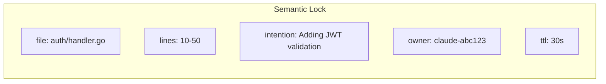
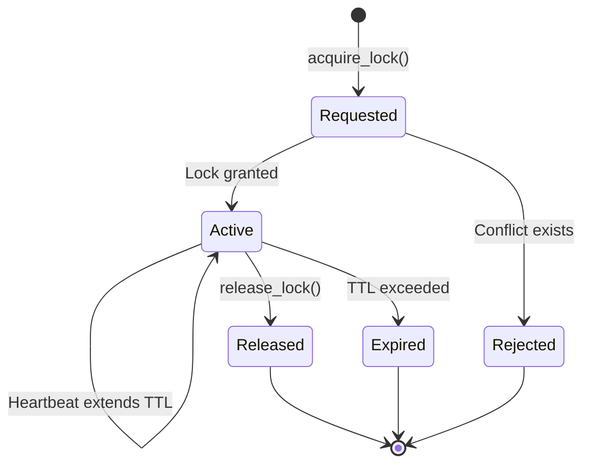
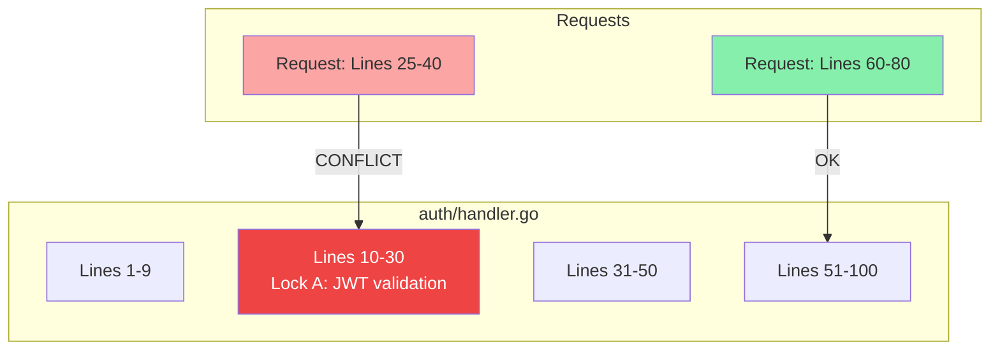
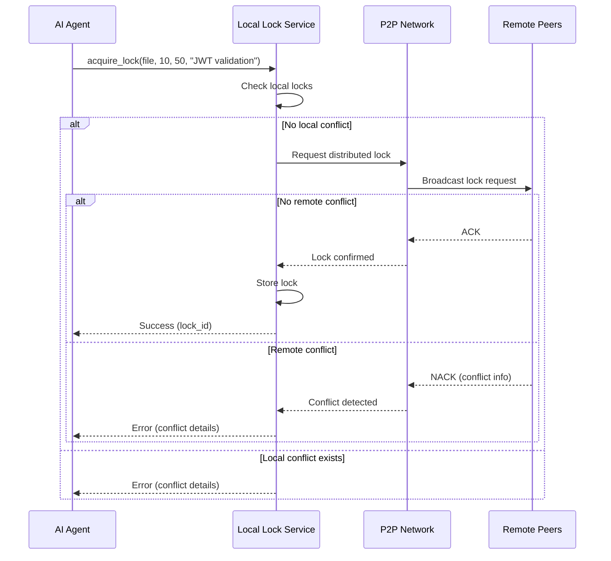
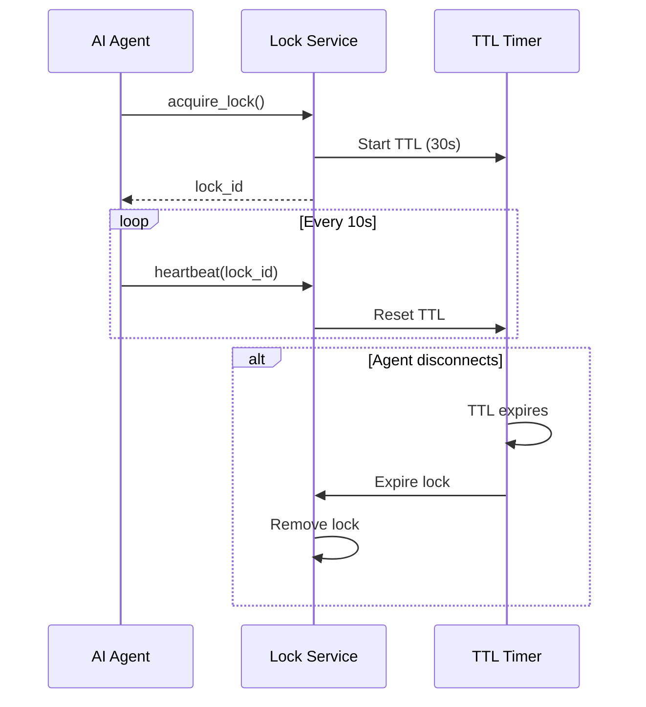
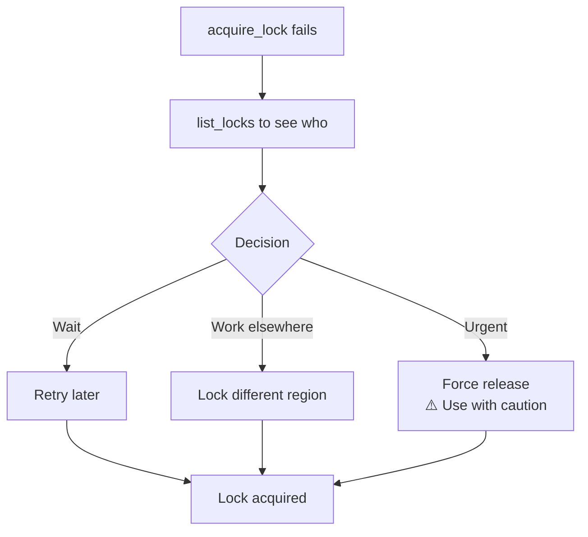
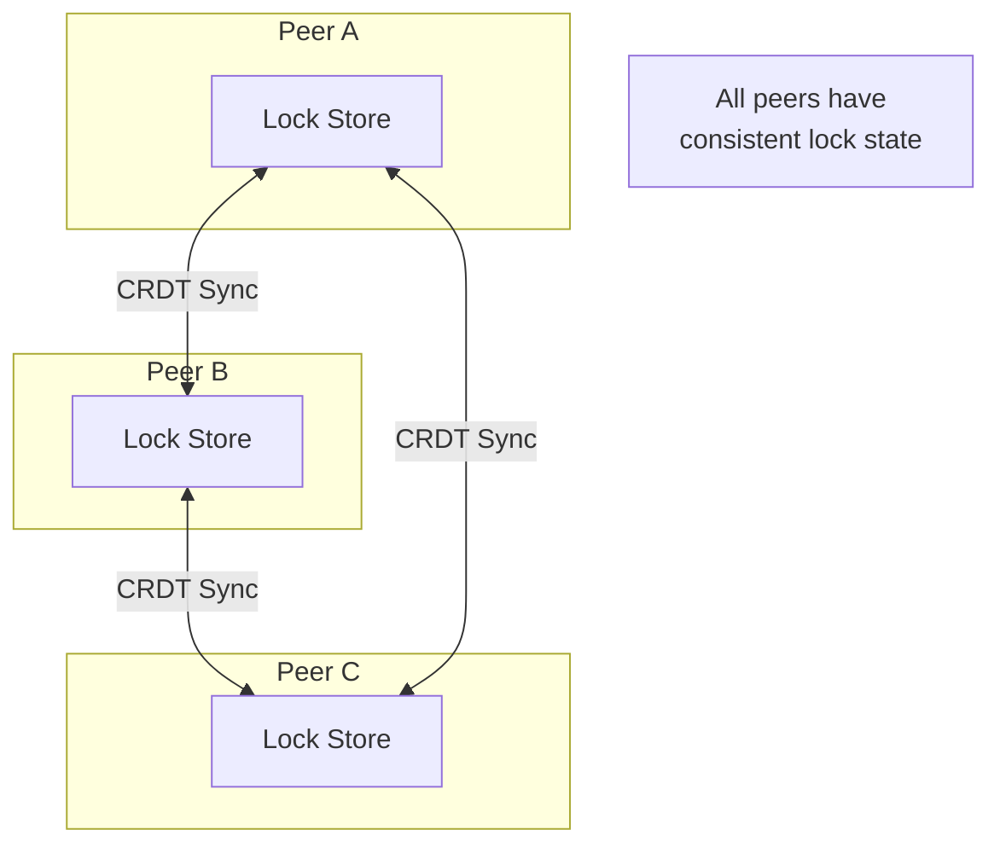

# How Locks Work

Semantic locks are the core mechanism for preventing conflicts between AI agents.

## What is a Semantic Lock?

A semantic lock is more than just a file lock. It captures:

- **What** file and line range is being modified
- **Why** the agent needs to modify it (intention)
- **Who** holds the lock (agent ID)
- **When** the lock was acquired and expires



## Lock Lifecycle



### States

| State | Description |
|-------|-------------|
| **Requested** | Agent requests a lock |
| **Active** | Lock is held by agent |
| **Released** | Agent explicitly released |
| **Expired** | TTL exceeded without heartbeat |
| **Rejected** | Conflicting lock exists |

## Conflict Detection



Locks conflict when:

1. **Same file** AND
2. **Overlapping line ranges**

Non-overlapping regions in the same file can be locked by different agents.

## Lock Acquisition Flow



## Heartbeat Mechanism

Locks require periodic heartbeats to stay active:



### Configuration

| Setting | Default | Description |
|---------|---------|-------------|
| `lock.default_ttl` | 30s | Lock time-to-live |
| `lock.heartbeat_interval` | 10s | Heartbeat frequency |

## Viewing Active Locks

### CLI

```bash
$ agent-collab lock list

┌─────────┬──────────────────────┬───────────┬─────────────────────────┬─────────────────────┐
│ ID      │ File                 │ Lines     │ Intention               │ Owner               │
├─────────┼──────────────────────┼───────────┼─────────────────────────┼─────────────────────┤
│ lock-1  │ auth/handler.go      │ 10-50     │ Adding JWT validation   │ claude-abc123       │
│ lock-2  │ db/connection.go     │ 100-150   │ Fixing connection pool  │ gemini-xyz789       │
└─────────┴──────────────────────┴───────────┴─────────────────────────┴─────────────────────┘
```

### MCP Tool

```json
// Request
{"tool": "list_locks"}

// Response
{
  "locks": [
    {
      "id": "lock-1",
      "file_path": "auth/handler.go",
      "start_line": 10,
      "end_line": 50,
      "intention": "Adding JWT validation",
      "owner": "claude-abc123",
      "created_at": "2024-01-15T10:30:00Z",
      "expires_at": "2024-01-15T10:30:30Z"
    }
  ]
}
```

## Handling Lock Conflicts

When a lock conflict occurs:



### Best Practices

!!! tip "Keep locks small"
    Only lock the lines you're actually modifying. Smaller locks = fewer conflicts.

!!! tip "Be specific with intentions"
    Clear intentions help other agents understand and avoid your work area.

!!! warning "Release promptly"
    Don't hold locks longer than necessary. Release as soon as you're done.

## Lock History

View recent lock activity:

```bash
$ agent-collab lock history

Recent lock activity (last 10):
┌─────────────────────┬──────────────────────┬───────────────┬─────────────────────────┐
│ Time                │ File                 │ Action        │ Agent                   │
├─────────────────────┼──────────────────────┼───────────────┼─────────────────────────┤
│ 10:45:23            │ auth/handler.go      │ acquired      │ claude-abc123           │
│ 10:42:15            │ auth/handler.go      │ released      │ claude-abc123           │
│ 10:30:00            │ db/connection.go     │ acquired      │ gemini-xyz789           │
└─────────────────────┴──────────────────────┴───────────────┴─────────────────────────┘
```

## Distributed Consensus

Locks are synchronized across all peers using a consensus protocol:



The CRDT-based approach ensures:

- **Eventual consistency** across all peers
- **Partition tolerance** - works even with network splits
- **No single point of failure** - any peer can process locks
