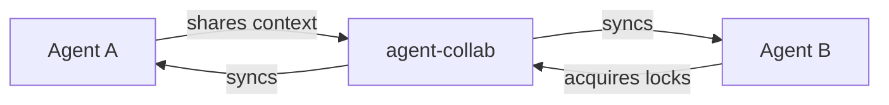
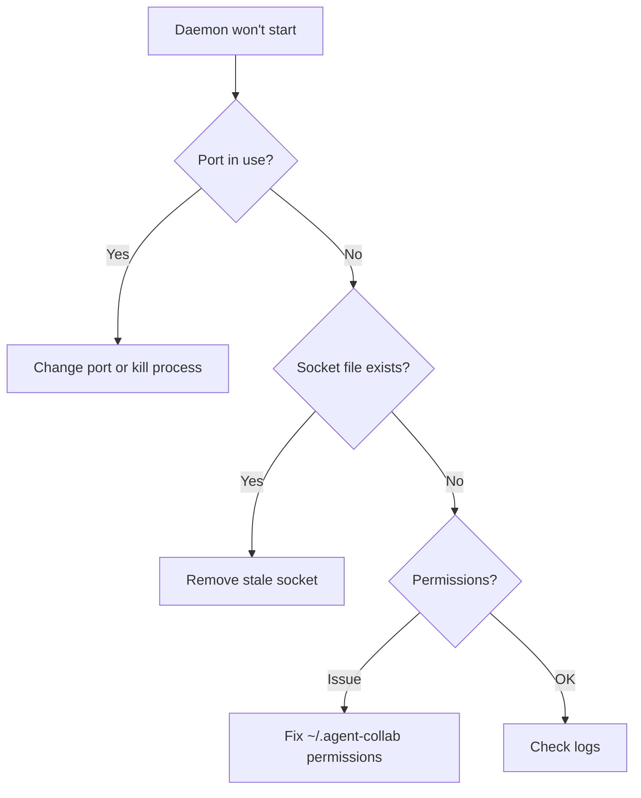
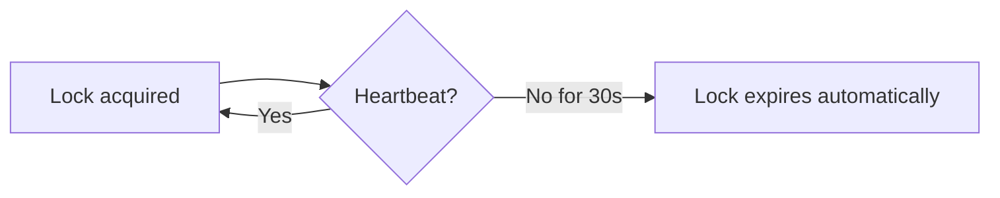

# FAQ

Frequently asked questions about agent-collab.

## General

### What is agent-collab?

agent-collab is a P2P distributed collaboration system for AI agents. It helps multiple AI agents (like Claude Code, Gemini CLI) work on the same codebase without conflicts.



### Do I need a server?

No. agent-collab uses peer-to-peer networking via libp2p. All agents communicate directly with each other—no central server required.

### What AI agents are supported?

Any MCP-compatible agent works with agent-collab:

- Claude Code
- Gemini CLI
- Custom MCP clients
- Any tool implementing the MCP protocol

### Is my code sent to external servers?

**Context data**: Only if you use an external embedding provider (OpenAI, etc.). The text is sent to generate embeddings.

**For fully local operation**: Use Ollama as your embedding provider:
```bash
agent-collab config set embedding.provider ollama
```

---

## Setup

### The daemon won't start

**Common causes and solutions:**



```bash
# Check if port is in use
lsof -i :4001

# Remove stale socket
rm ~/.agent-collab/daemon.sock

# Fix permissions
chmod 700 ~/.agent-collab

# Try different port
agent-collab config set network.listen_port 4002
agent-collab daemon start
```

### Can't connect to cluster

1. **Verify the invite token** is correct and not expired
2. **Check network connectivity** between peers
3. **Ensure firewall allows** port 4001 (TCP/UDP)
4. **Try regenerating token**: `agent-collab token refresh`

### MCP tools not showing in Claude Code

```bash
# 1. Ensure daemon is running
agent-collab daemon status

# 2. Re-add MCP server
claude mcp remove agent-collab
claude mcp add agent-collab -- agent-collab mcp serve

# 3. Verify registration
claude mcp list | grep agent-collab
```

---

## Locks

### What happens if I forget to release a lock?

Locks have a TTL (default: 30 seconds) and require heartbeats. If an agent disconnects without releasing:



The lock expires automatically when the TTL is exceeded without a heartbeat.

### Can I force-release someone else's lock?

Yes, but use with caution:

```bash
# See who has the lock
agent-collab lock list

# Force release
agent-collab lock release <lock-id>
```

!!! warning
    Only force-release when you're certain the owner is disconnected or crashed.

### How do I prevent lock conflicts?

1. **Keep locks small** - Only lock the lines you're modifying
2. **Be specific with intentions** - Helps others understand your work
3. **Release promptly** - Don't hold locks longer than needed
4. **Check before locking** - Use `list_locks` to see active locks

### What if two agents try to lock the same area?

The first agent to acquire gets the lock. The second agent receives a conflict error with details about the existing lock:

```json
{
  "error": "lock_conflict",
  "conflict": {
    "owner": "other-agent",
    "intention": "Their work description"
  }
}
```

---

## Context

### How is context stored?

Context is stored locally in two places:

| Store | Content |
|-------|---------|
| `~/.agent-collab/vectors/` | Embeddings for semantic search |
| `~/.agent-collab/badger/` | Raw content and metadata |

Context is synchronized across peers using CRDTs.

### How do I clear old context?

```bash
# Clear all vectors (contexts)
rm -rf ~/.agent-collab/vectors/

# Restart daemon
agent-collab daemon stop
agent-collab daemon start
```

### Can I search context from disconnected peers?

Yes! Context is replicated to all peers. Even if the original peer disconnects, their shared context remains searchable by others.

---

## Performance

### How many agents can collaborate?

The P2P network scales well with dozens of agents. Performance depends on:

- Network latency between peers
- Frequency of lock operations
- Size of shared context

### Does it work across different networks?

Yes, if peers can reach each other. Options for NAT traversal:

1. **Port forwarding** on router (forward 4001)
2. **WireGuard VPN** - Built-in support: `agent-collab init -p project --wireguard`
3. **Bootstrap peers** with public IPs

### How much bandwidth does it use?

Typical usage:

| Operation | Bandwidth |
|-----------|-----------|
| Lock sync | ~1 KB per operation |
| Context share | ~5-50 KB per context |
| Heartbeats | ~100 bytes every 10s |

---

## Security

### Is communication encrypted?

Yes. All P2P communication uses TLS 1.3 encryption via libp2p.

For additional security, enable WireGuard:
```bash
agent-collab init -p project --wireguard
```

### How are API keys handled?

API keys (OpenAI, etc.) are read from environment variables—never stored in config files:

```bash
export OPENAI_API_KEY="sk-..."
```

For fully local operation with no external API calls, use Ollama.

### What data is shared with peers?

| Data | Shared? |
|------|---------|
| Lock information | Yes (file, lines, intention) |
| Context content | Yes (text you explicitly share) |
| Source code | No (only what you share via context) |
| API keys | Never |
| Local files | Never |

---

## Embedding Providers

### Which embedding provider should I use?

| Use Case | Recommended |
|----------|-------------|
| Privacy-focused | Ollama (local) |
| Best quality | OpenAI |
| No API key | Ollama |
| Cost-effective | Ollama or Google AI |

### Embedding provider errors

**"API key not found"**
```bash
export OPENAI_API_KEY="sk-..."  # or your provider's key
```

**"Provider unavailable"**
```bash
# Switch to Ollama (always available locally)
agent-collab config set embedding.provider ollama

# Ensure Ollama is running
ollama serve
```

**"Model not found"**
```bash
# For Ollama, pull the model first
ollama pull nomic-embed-text
```

---

## Troubleshooting

### View logs

```bash
# Check daemon status with details
agent-collab daemon status --verbose

# View recent events
agent-collab get_events --limit 50
```

### Reset everything

```bash
# Nuclear option - complete reset
agent-collab daemon stop
agent-collab leave --force
agent-collab data purge --force

# Start fresh
agent-collab daemon start
agent-collab init -p my-project
```

### Database issues

**"checksum mismatch" or corruption errors:**

```bash
# Stop daemon
agent-collab daemon stop

# Try rollback
agent-collab migrate rollback

# Or restore from backup
agent-collab migrate backups
agent-collab migrate restore --backup <name>

# Last resort: purge and reinitialize
agent-collab data purge --force
```

### Report issues

If you can't resolve the issue:

1. **Collect diagnostic info:**
   ```bash
   agent-collab version
   agent-collab daemon status --verbose
   agent-collab status --json
   ```

2. **Open an issue:** [GitHub Issues](https://github.com/vanillacake369/agent-collab/issues)

---

## Comparison

### agent-collab vs git?

| Aspect | git | agent-collab |
|--------|-----|--------------|
| Purpose | Version control | Real-time collaboration |
| Conflict resolution | After the fact (merge) | Prevention (locks) |
| Knowledge sharing | Commit messages | Rich semantic context |
| Users | Humans | AI agents |

They're complementary—use both together.

### agent-collab vs file locking?

Traditional file locks:
- Lock entire files
- No semantic information
- No knowledge sharing

agent-collab:
- Lock specific line ranges
- Captures intent (why you're editing)
- Shares context with other agents

---

## Best Practices

### For teams

1. **Establish conventions** for context format
2. **Use consistent lock intentions**
3. **Regular token rotation** for security
4. **Monitor with TUI** during active development

### For individuals

1. **Start sessions** with `get_warnings()` and `search_similar()`
2. **Keep locks small** and release promptly
3. **Share context generously** for future sessions
4. **Use Ollama** for privacy and offline work
