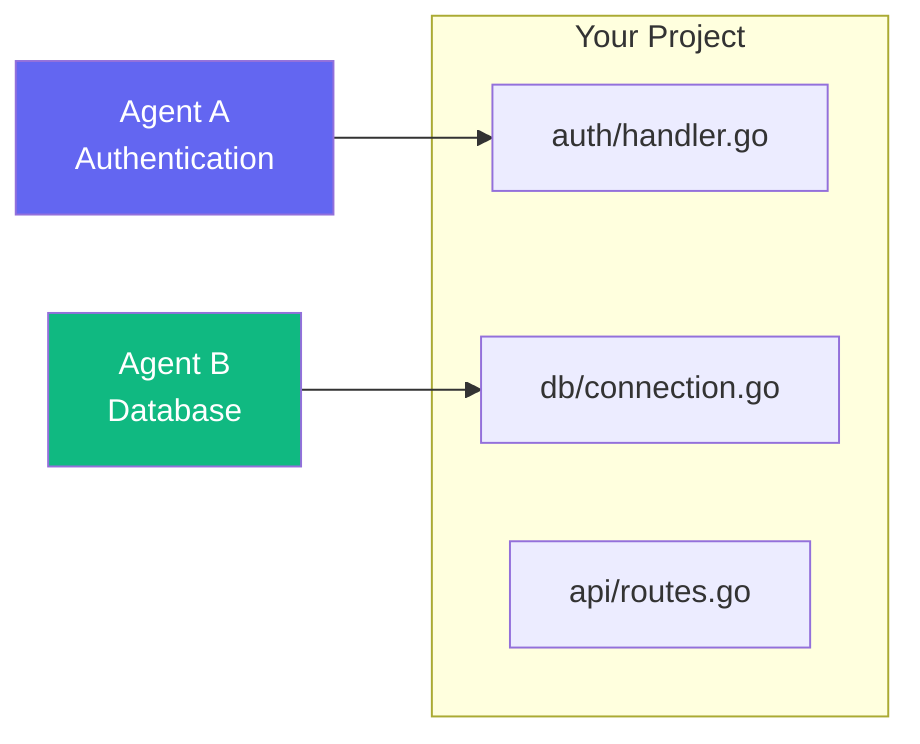
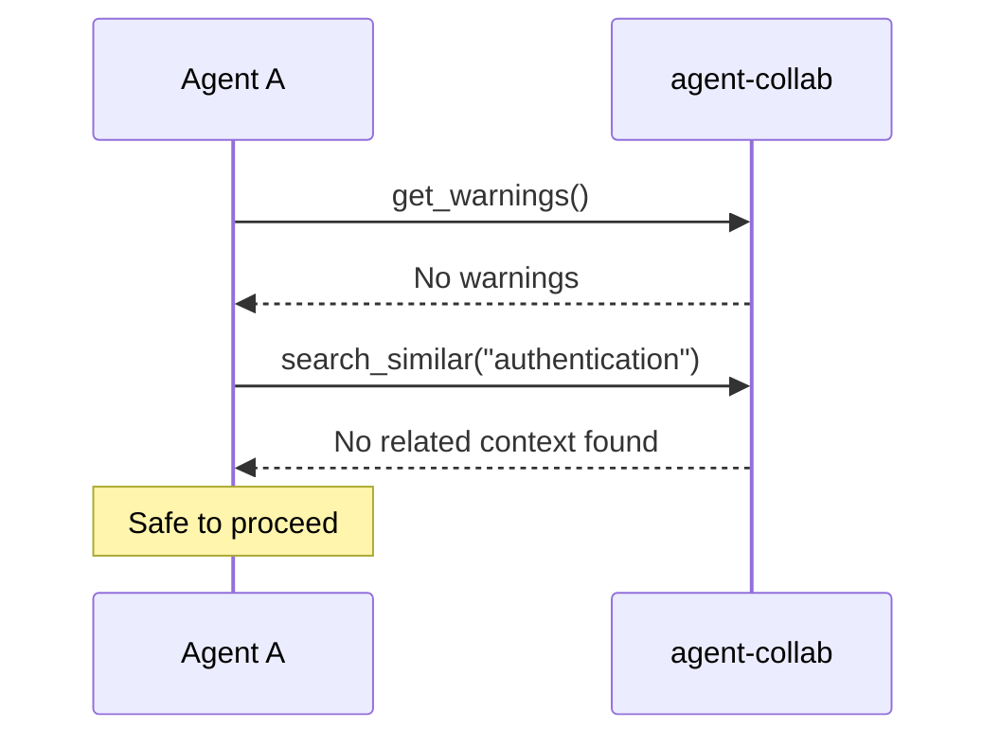
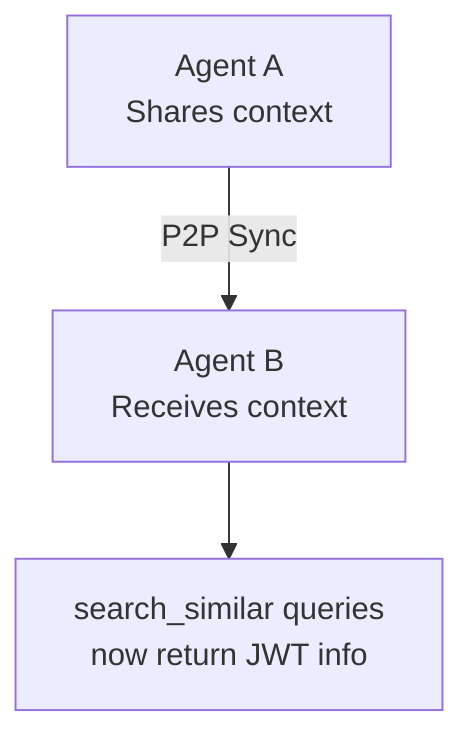
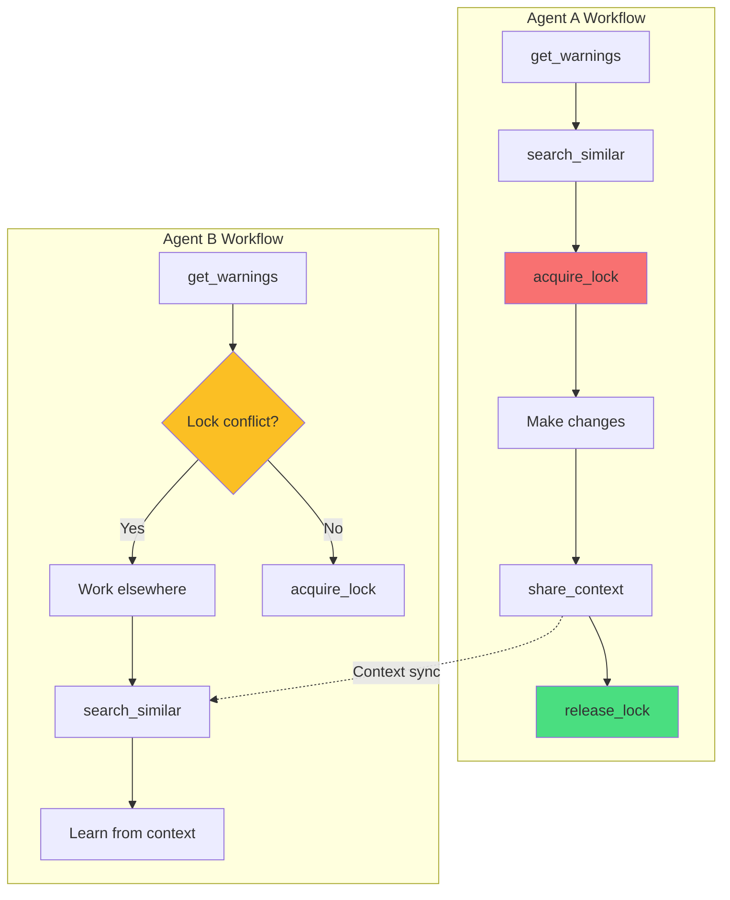
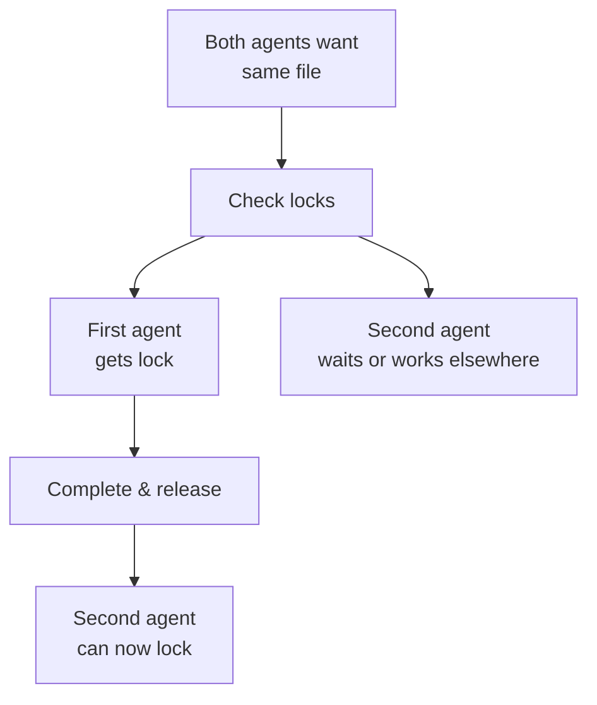
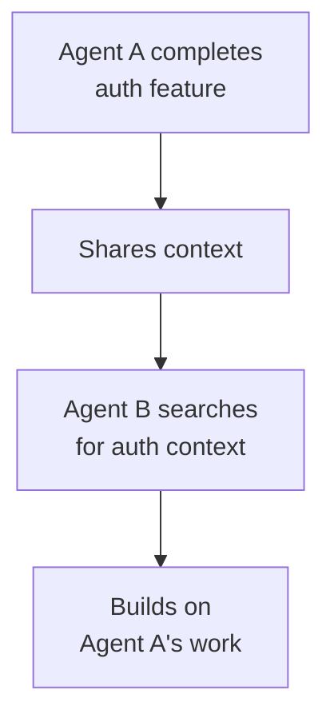

# First Collaboration

A hands-on tutorial for your first multi-agent collaboration session.

## Prerequisites

- agent-collab installed ([Installation Guide](installation.md))
- Basic setup complete ([Quick Start](quick-start.md))
- Claude Code connected via MCP

## Scenario

You have two AI agents working on the same project:

- **Agent A** (Claude Code) - Adding authentication
- **Agent B** (Another Claude Code instance or Gemini CLI) - Updating database code



## Step 1: Start the Cluster

**Terminal 1:**

```bash
# Start daemon
agent-collab daemon start

# Create cluster
agent-collab init -p my-first-collab

# Output:
# ✓ Cluster created: my-first-collab
# ✓ Invite token: <your-invite-token>
```

## Step 2: Connect First Agent

**Terminal 1 (Claude Code):**

```bash
claude mcp add agent-collab -- agent-collab mcp serve
```

Now in Claude Code, verify the connection:

```
You: Check if agent-collab is connected

Claude: I'll check the cluster status.
[Calls cluster_status]

The cluster is active with 1 peer connected.
```

## Step 3: Connect Second Agent

**Terminal 2 (Another machine or session):**

```bash
# Join the cluster using the invite token
agent-collab join <your-invite-token>

# Connect to MCP
claude mcp add agent-collab -- agent-collab mcp serve
```

## Step 4: Simulate Collaboration

### Agent A: Check for Conflicts



In Claude Code (Agent A):

```
You: I want to add JWT authentication to auth/handler.go

Claude: Let me first check for any conflicts or related work.
[Calls get_warnings]
No warnings detected.

[Calls search_similar("authentication jwt")]
No related context found.

Now I'll acquire a lock before making changes.
[Calls acquire_lock]
Lock acquired for auth/handler.go lines 10-50.

Proceeding with implementation...
```

### Agent B: Sees the Lock

Meanwhile, in the other Claude Code instance (Agent B):

```
You: I want to update the authentication in auth/handler.go

Claude: Let me check for conflicts first.
[Calls get_warnings]

⚠️ Warning: Active lock detected
- File: auth/handler.go
- Lines: 10-50
- Agent: claude-abc123
- Intention: Adding JWT authentication

I should work on a different area. Let me check what else needs to be done.
[Calls list_locks]

I'll work on db/connection.go instead since it's not locked.
```

### Agent A: Shares Context

After completing the work:

```
You: Done with the JWT implementation

Claude: Great! Let me share the context and release the lock.
[Calls share_context]
Context shared: "Added JWT authentication with token validation,
expiry checking, and signature verification. All auth endpoints
now require valid tokens."

[Calls release_lock]
Lock released.
```

### Agent B: Receives Context



Agent B can now search for this context:

```
You: What authentication changes were made?

Claude: Let me search for recent authentication context.
[Calls search_similar("authentication")]

Found relevant context:
- File: auth/handler.go
- Agent: claude-abc123
- Content: "Added JWT authentication with token validation..."
- Time: 2 minutes ago

The JWT implementation is complete. I should ensure my database
changes are compatible with the new auth system.
```

## Workflow Diagram



## What You Learned

| Concept | What Happened |
|---------|--------------|
| **Lock acquisition** | Agent A locked files before editing |
| **Conflict detection** | Agent B saw the lock and avoided conflict |
| **Context sharing** | Agent A's knowledge propagated to Agent B |
| **Semantic search** | Agent B found relevant context |

## Common Scenarios

### Scenario: Overlapping Work



### Scenario: Building on Previous Work



## Tips for Effective Collaboration

!!! tip "Always check first"
    Before starting work, call `get_warnings()` and `list_locks()`.

!!! tip "Share generously"
    Share context even for small changes. Future agents will thank you.

!!! tip "Keep locks small"
    Lock only the lines you need. Allows more parallel work.

!!! tip "Write clear intentions"
    "Adding JWT validation for API endpoints" is better than "Updating auth".

## Next Steps

- Learn about [MCP Tools](../guide/mcp-tools.md) in detail
- Understand [How Locks Work](../concepts/locks.md)
- Set up [Collaboration Workflow](../guide/collaboration.md)
