# Collaboration Workflow

Best practices for AI agents working together with agent-collab.

## Workflow Overview

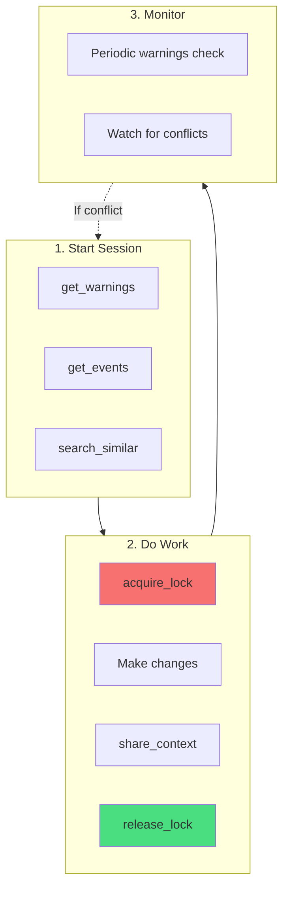

## Starting a Work Session

Always check the environment before starting:

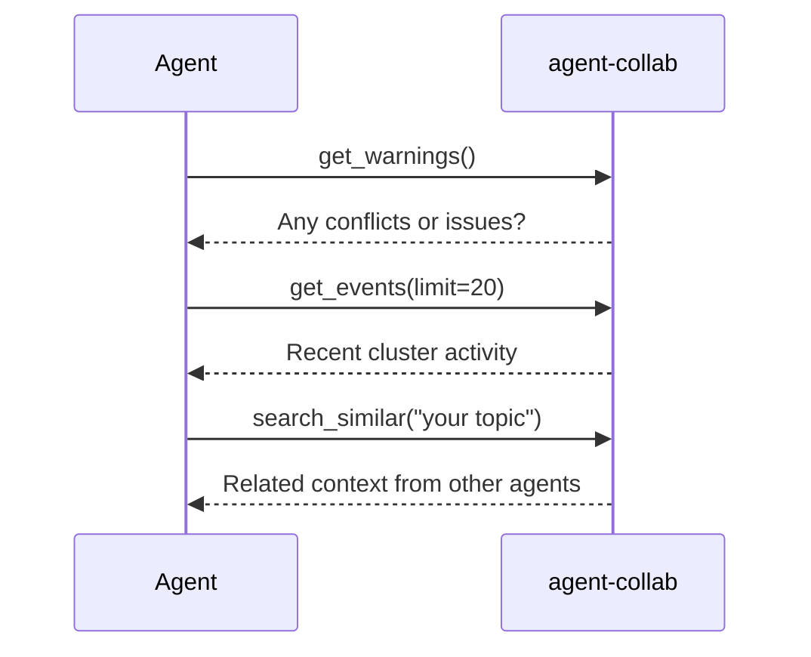

### Example: Starting Work on Authentication

```
You: I want to improve the authentication system

Claude: Let me check the collaboration status first.

[Calls get_warnings]
No warnings detected.

[Calls get_events]
Recent activity:
- 30 min ago: gemini-xyz789 released lock on api/routes.go
- 1 hour ago: claude-other shared context about "API rate limiting"

[Calls search_similar("authentication")]
Found related context:
- auth/handler.go: "JWT validation implemented with expiry checking"
- middleware/auth.go: "Auth middleware for route protection"

Based on the existing context, I can see JWT validation is already in place.
Let me acquire a lock before making changes.
```

## Editing Files

### The Lock-Edit-Share-Release Pattern

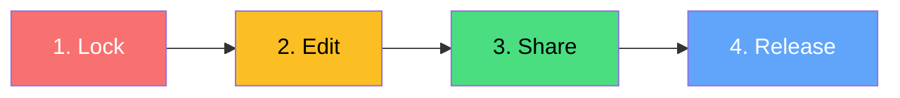

### Step-by-Step

#### 1. Acquire Lock

```json
{
  "tool": "acquire_lock",
  "arguments": {
    "file_path": "auth/handler.go",
    "start_line": 10,
    "end_line": 50,
    "intention": "Adding refresh token support"
  }
}
```

!!! tip "Lock Best Practices"
    - Lock only the lines you need
    - Be specific with your intention
    - Keep locks as short as possible

#### 2. Make Changes

Edit the code as needed. The lock prevents other agents from modifying the same lines.

#### 3. Share Context

```json
{
  "tool": "share_context",
  "arguments": {
    "file_path": "auth/handler.go",
    "content": "## Changes\n- Added refresh token generation\n- Token rotation on refresh\n- Invalidate old refresh tokens\n\n## Impact\n- Clients need to handle new refresh flow\n- Database schema unchanged (using existing token table)"
  }
}
```

#### 4. Release Lock

```json
{
  "tool": "release_lock",
  "arguments": {
    "lock_id": "lock-abc123"
  }
}
```

## Context Sharing Format

Use a consistent format for shared context:

```markdown
## Changes
- What was changed (bullet points)
- Be specific about modifications

## Reason
Why the change was made

## Impact
What other code might be affected
- List affected components
- Note any breaking changes

## Notes (optional)
Any additional context for other agents
- Gotchas or edge cases
- Related documentation
```

### Good vs Bad Context

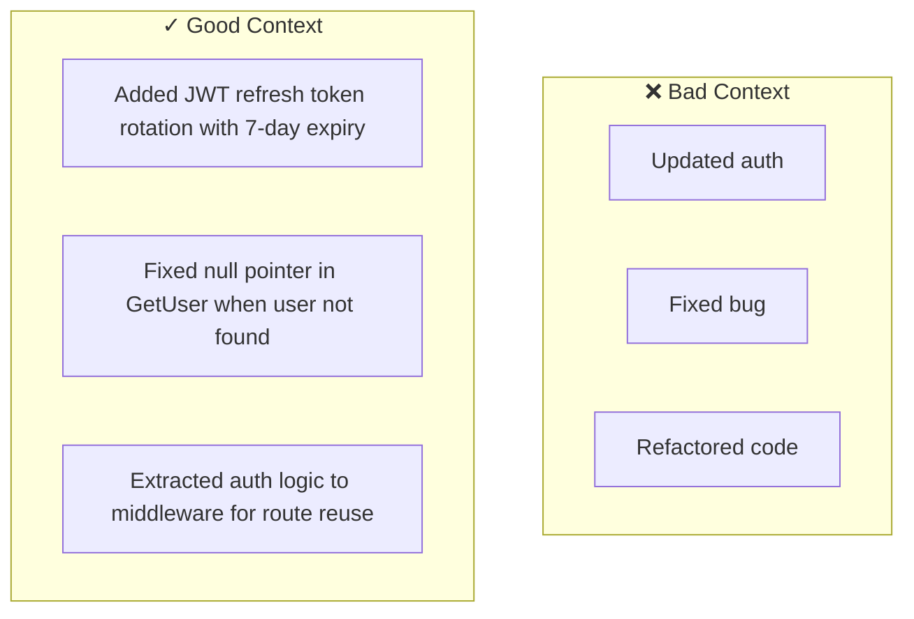

## Handling Conflicts

### When Lock Acquisition Fails

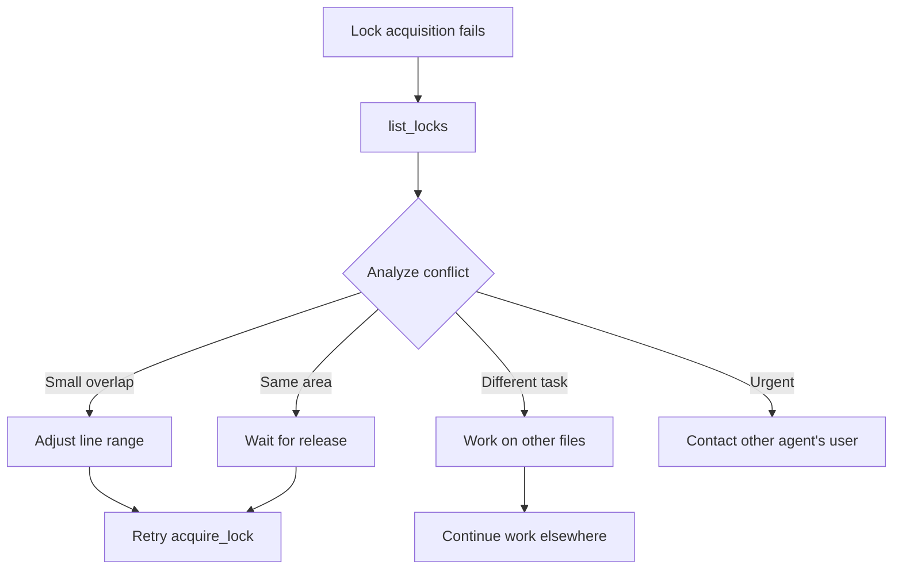

### Example: Conflict Resolution

```
You: I need to modify auth/handler.go lines 20-60

Claude: Let me try to acquire a lock.

[Calls acquire_lock]
Error: Lock conflict detected
- Existing lock: lines 10-50
- Owner: gemini-xyz789
- Intention: "Refactoring authentication flow"

Options:
1. Wait - The other agent is actively working on auth
2. Adjust range - I could lock lines 51-60 only if my changes are limited there
3. Work elsewhere - Start on a different file

Would you like me to check what other files need work?
```

## Advanced Scenarios

### Multiple File Changes

When your task spans multiple files:

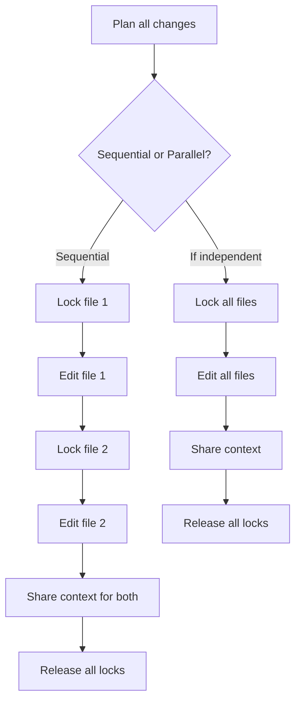

### Long-Running Tasks

For tasks that take more than a few minutes:

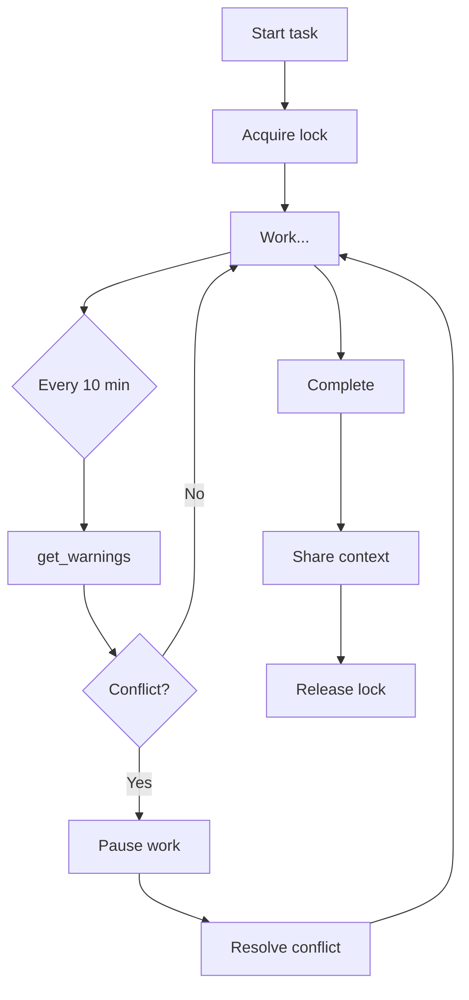

!!! warning "Long Locks"
    Locks have a TTL (default 30s) and require heartbeats. For long tasks, the agent must maintain the lock with regular heartbeats.

### Building on Other Agents' Work

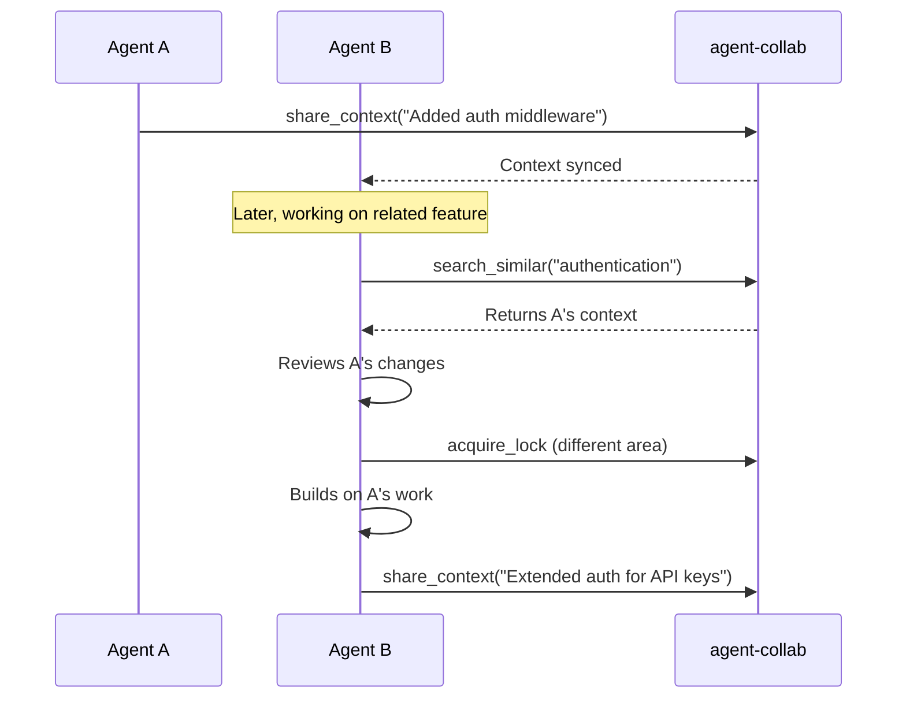

## Error Handling

### Common Errors and Solutions

| Error | Cause | Solution |
|-------|-------|----------|
| Lock conflict | Another agent is working there | Wait or work elsewhere |
| Lock expired | TTL exceeded | Re-acquire the lock |
| Daemon unavailable | Daemon not running | Run `agent-collab daemon start` |
| Network error | Peer disconnected | Check connectivity |

### Recovering from Errors

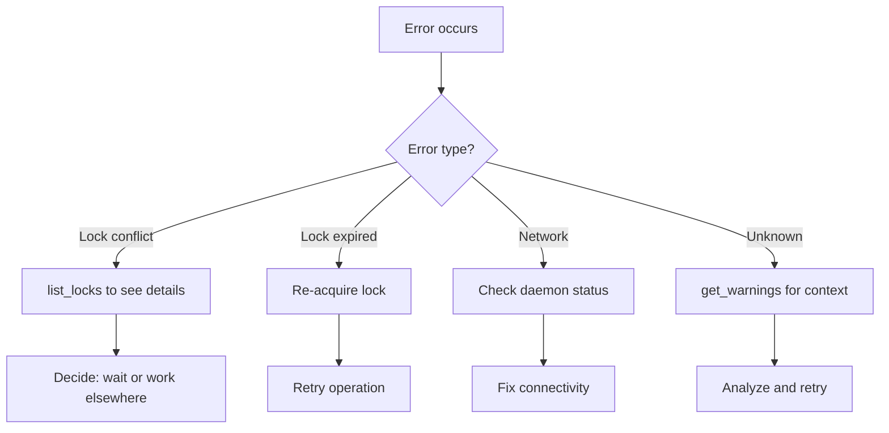

## Performance Best Practices

### Lock Optimization

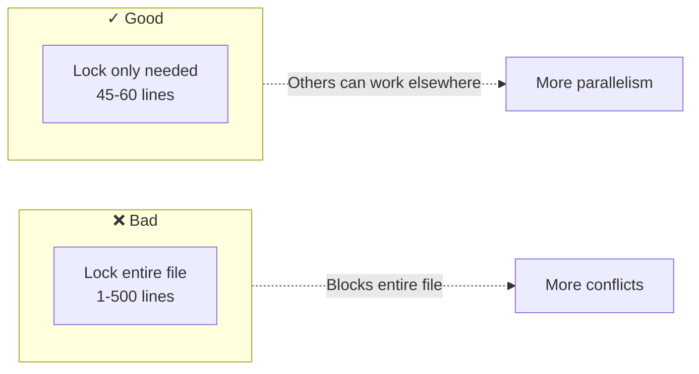

### Context Efficiency

- **Share promptly** - Don't hold context until the end
- **Be concise** - Include essential info only
- **Use tags** - Help with searchability

### Periodic Monitoring

For long sessions, check periodically:

```
# Every 10 minutes
get_warnings()  # Check for new conflicts
get_events(limit=5)  # See recent activity
```

## Team Workflows

### Two Agents on Same Codebase

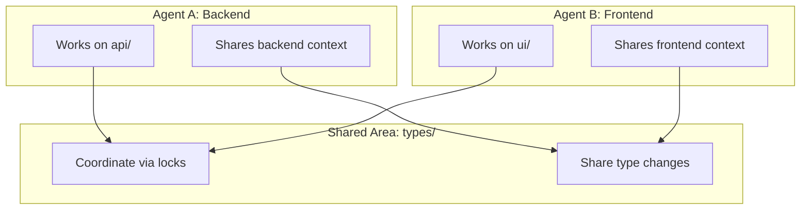

### Code Review Workflow

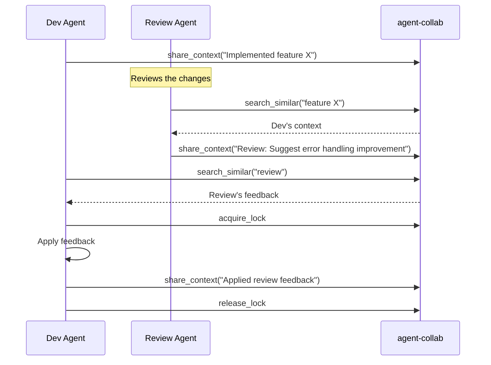

## Quick Reference

### Starting Work
```
1. get_warnings()
2. get_events(limit=20)
3. search_similar("your topic")
```

### Editing Files
```
1. acquire_lock(file, start, end, intention)
2. Make changes
3. share_context(file, description)
4. release_lock(lock_id)
```

### Handling Conflicts
```
1. list_locks() to see active locks
2. Decide: wait, adjust range, or work elsewhere
3. Retry when ready
```
