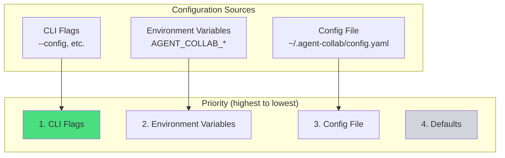
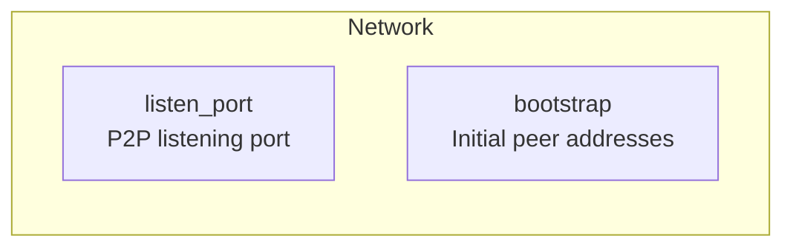
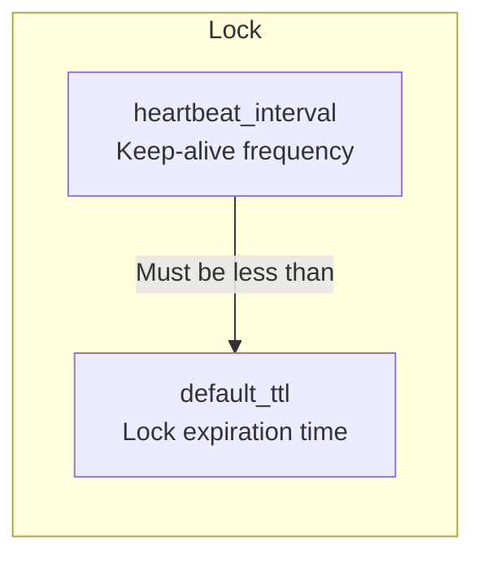
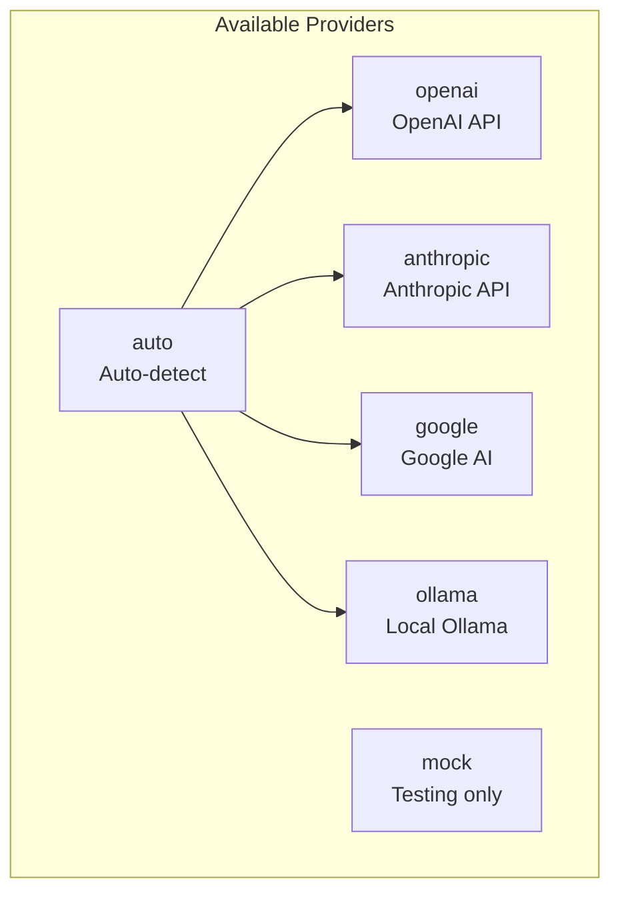
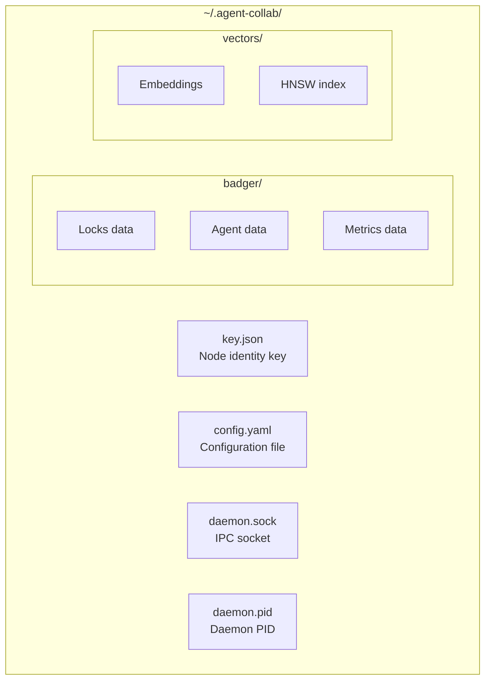

# Configuration

Customize agent-collab for your workflow.

## Configuration Overview



## Viewing Configuration

```bash
agent-collab config show
```

**Example Output:**

```yaml
network:
  listen_port: 4001
  bootstrap: []

lock:
  default_ttl: 30s
  heartbeat_interval: 10s

context:
  sync_interval: 5s

token:
  daily_limit: 200000

embedding:
  provider: auto
  model: ""
  base_url: ""

ui:
  theme: dark
```

## Setting Configuration

```bash
agent-collab config set <key> <value>
```

**Examples:**

```bash
# Network settings
agent-collab config set network.listen_port 4002

# Lock settings
agent-collab config set lock.default_ttl 60s

# Embedding provider
agent-collab config set embedding.provider ollama
```

## Configuration Reference

### Network Settings



| Key | Type | Default | Description |
|-----|------|---------|-------------|
| `network.listen_port` | int | 4001 | P2P listening port (1-65535) |
| `network.bootstrap` | []string | [] | Bootstrap peer multiaddresses |

**Examples:**

```bash
# Change port (useful if 4001 is in use)
agent-collab config set network.listen_port 4002

# Add bootstrap peer
agent-collab config set network.bootstrap "/ip4/192.168.1.100/tcp/4001/p2p/12D3KooW..."
```

### Lock Settings



| Key | Type | Default | Description |
|-----|------|---------|-------------|
| `lock.default_ttl` | duration | 30s | Lock time-to-live |
| `lock.heartbeat_interval` | duration | 10s | Heartbeat frequency |

**Relationship:**

- `heartbeat_interval` should be less than `default_ttl`
- Recommended: `heartbeat_interval` = `default_ttl` / 3

**Examples:**

```bash
# Longer locks for slow networks
agent-collab config set lock.default_ttl 60s
agent-collab config set lock.heartbeat_interval 20s
```

### Context Settings

| Key | Type | Default | Description |
|-----|------|---------|-------------|
| `context.sync_interval` | duration | 5s | Context sync frequency |

**Examples:**

```bash
# Faster sync for real-time collaboration
agent-collab config set context.sync_interval 2s

# Slower sync for bandwidth-limited networks
agent-collab config set context.sync_interval 30s
```

### Token Settings

| Key | Type | Default | Description |
|-----|------|---------|-------------|
| `token.daily_limit` | int | 200000 | Daily API token limit |

This limit applies to embedding API calls (OpenAI, Anthropic, etc.).

```bash
# Increase limit for heavy usage
agent-collab config set token.daily_limit 500000
```

### Embedding Settings



| Key | Type | Default | Description |
|-----|------|---------|-------------|
| `embedding.provider` | string | auto | Provider name |
| `embedding.model` | string | | Model name (provider-specific) |
| `embedding.base_url` | string | | Custom API endpoint |

**Providers and Requirements:**

| Provider | Environment Variable | Default Model |
|----------|---------------------|---------------|
| `openai` | `OPENAI_API_KEY` | text-embedding-3-small |
| `anthropic` | `ANTHROPIC_API_KEY` | voyage-2 |
| `google` | `GOOGLE_API_KEY` | text-embedding-004 |
| `ollama` | (none, auto-detect) | nomic-embed-text |
| `mock` | (none) | N/A (for testing) |

**Examples:**

```bash
# Use OpenAI
export OPENAI_API_KEY="sk-..."
agent-collab config set embedding.provider openai

# Use specific OpenAI model
agent-collab config set embedding.model text-embedding-3-large

# Use Ollama (local, no API key)
agent-collab config set embedding.provider ollama

# Custom Ollama URL
agent-collab config set embedding.base_url http://localhost:11434
```

### UI Settings

| Key | Type | Default | Description |
|-----|------|---------|-------------|
| `ui.theme` | string | dark | UI theme (dark, light) |

```bash
agent-collab config set ui.theme light
```

## Environment Variables

All configuration can be set via environment variables:

| Variable | Config Key |
|----------|-----------|
| `AGENT_COLLAB_CONFIG` | Config file path |
| `AGENT_COLLAB_DATA` | Data directory |
| `AGENT_COLLAB_NETWORK_LISTEN_PORT` | `network.listen_port` |
| `AGENT_COLLAB_LOCK_DEFAULT_TTL` | `lock.default_ttl` |
| `AGENT_COLLAB_EMBEDDING_PROVIDER` | `embedding.provider` |

**API Keys:**

| Variable | Provider |
|----------|----------|
| `OPENAI_API_KEY` | OpenAI |
| `ANTHROPIC_API_KEY` | Anthropic |
| `GOOGLE_API_KEY` | Google AI |
| `OLLAMA_HOST` | Ollama server URL |

## Configuration Profiles

### Development Profile

```bash
# Fast sync, local embeddings
agent-collab config set context.sync_interval 2s
agent-collab config set embedding.provider ollama
agent-collab config set lock.default_ttl 30s
```

### Production Profile

```bash
# Reliable settings for production
agent-collab config set context.sync_interval 10s
agent-collab config set lock.default_ttl 60s
agent-collab config set lock.heartbeat_interval 20s
```

### High-Security Profile

```bash
# Enable WireGuard, local embeddings only
agent-collab init -p my-project --wireguard
agent-collab config set embedding.provider ollama
```

## Reset Configuration

```bash
# Reset to defaults
agent-collab config reset

# Force reset without confirmation
agent-collab config reset --force
```

## Data Directory

All data is stored in `~/.agent-collab/`:



| Path | Purpose |
|------|---------|
| `~/.agent-collab/key.json` | Node identity (Ed25519 key pair) |
| `~/.agent-collab/config.yaml` | Configuration file |
| `~/.agent-collab/badger/` | BadgerDB storage |
| `~/.agent-collab/vectors/` | Vector embeddings |
| `~/.agent-collab/daemon.sock` | Daemon IPC socket |
| `~/.agent-collab/daemon.pid` | Daemon process ID |

### Custom Data Directory

```bash
# Set custom data directory
export AGENT_COLLAB_DATA=/custom/path

# Or via config
agent-collab --config /custom/config.yaml daemon start
```

## Configuration Changes

### When Changes Take Effect

| Setting | Effect | Requires Restart |
|---------|--------|------------------|
| `network.listen_port` | New connections | Yes (daemon) |
| `lock.default_ttl` | New locks | No |
| `context.sync_interval` | Immediately | No |
| `embedding.provider` | Next embedding | No |
| `ui.theme` | Next TUI start | No |

### Restarting After Changes

```bash
# Restart daemon to apply network changes
agent-collab daemon stop
agent-collab daemon start
```

## Troubleshooting Configuration

### Check Current Config

```bash
agent-collab config show
```

### Validate Config File

```bash
# Check for syntax errors
cat ~/.agent-collab/config.yaml | yq .
```

### Reset Bad Configuration

```bash
# If config is corrupted
rm ~/.agent-collab/config.yaml
agent-collab daemon start  # Creates new config with defaults
```
