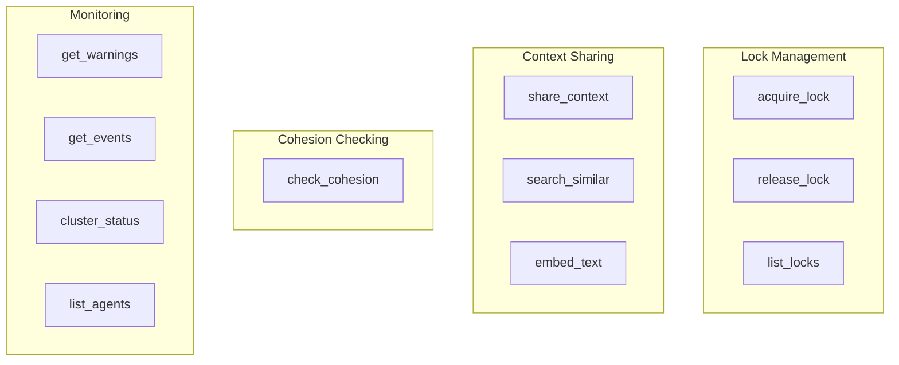
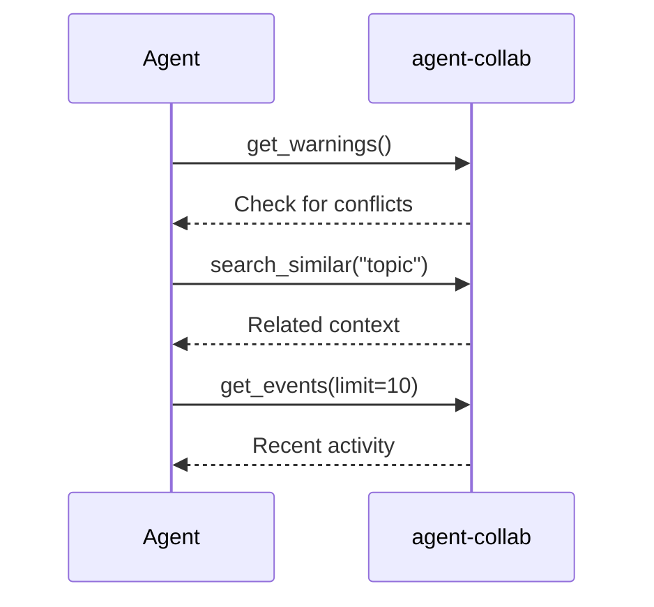
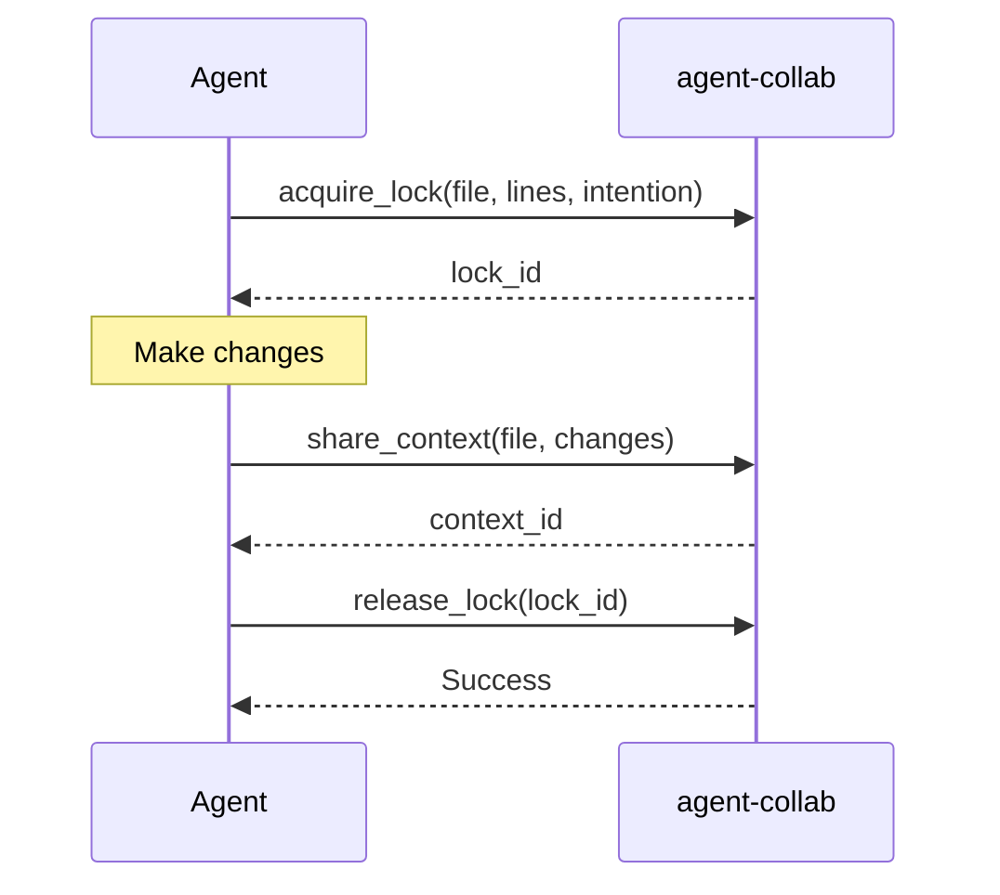
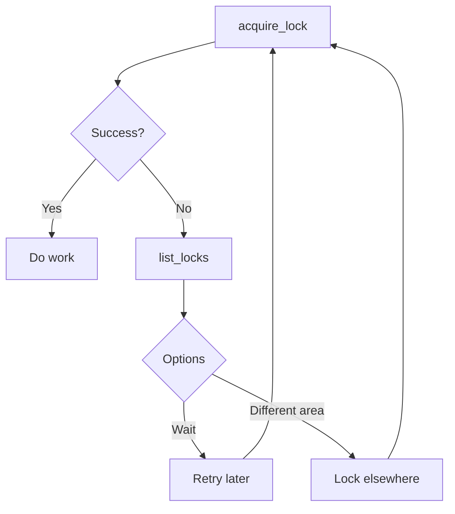

# MCP Tools

Complete reference for MCP tools available to AI agents.

## Tool Overview



---

## Lock Tools

### acquire_lock

Lock a code region before editing.

**Parameters:**

| Name | Type | Required | Description |
|------|------|----------|-------------|
| `file_path` | string | Yes | File to lock |
| `start_line` | int | Yes | Start line number |
| `end_line` | int | Yes | End line number |
| `intention` | string | Yes | What you plan to do |

**Request:**

```json
{
  "tool": "acquire_lock",
  "arguments": {
    "file_path": "auth/handler.go",
    "start_line": 10,
    "end_line": 50,
    "intention": "Adding JWT token validation logic"
  }
}
```

**Success Response:**

```json
{
  "success": true,
  "lock_id": "lock-abc123",
  "expires_at": "2024-01-15T10:30:30Z"
}
```

**Error Response:**

```json
{
  "success": false,
  "error": "lock_conflict",
  "message": "Conflicting lock exists",
  "conflict": {
    "lock_id": "lock-xyz789",
    "file_path": "auth/handler.go",
    "start_line": 20,
    "end_line": 60,
    "owner": "claude-other",
    "intention": "Refactoring auth logic"
  }
}
```

---

### release_lock

Release a held lock.

**Parameters:**

| Name | Type | Required | Description |
|------|------|----------|-------------|
| `lock_id` | string | Yes | Lock ID to release |

**Request:**

```json
{
  "tool": "release_lock",
  "arguments": {
    "lock_id": "lock-abc123"
  }
}
```

**Response:**

```json
{
  "success": true
}
```

---

### list_locks

View all active locks in the cluster.

**Parameters:** None

**Request:**

```json
{
  "tool": "list_locks",
  "arguments": {}
}
```

**Response:**

```json
{
  "locks": [
    {
      "id": "lock-abc123",
      "file_path": "auth/handler.go",
      "start_line": 10,
      "end_line": 50,
      "intention": "Adding JWT validation",
      "owner": "claude-abc123",
      "created_at": "2024-01-15T10:30:00Z",
      "expires_at": "2024-01-15T10:30:30Z"
    },
    {
      "id": "lock-xyz789",
      "file_path": "db/connection.go",
      "start_line": 100,
      "end_line": 150,
      "intention": "Fixing connection pool leak",
      "owner": "gemini-xyz789",
      "created_at": "2024-01-15T10:28:00Z",
      "expires_at": "2024-01-15T10:28:30Z"
    }
  ]
}
```

---

## Context Tools

### share_context

Share knowledge with other agents.

**Parameters:**

| Name | Type | Required | Description |
|------|------|----------|-------------|
| `file_path` | string | Yes | Related file path |
| `content` | string | Yes | Context to share |
| `metadata` | object | No | Additional metadata |

**Request:**

```json
{
  "tool": "share_context",
  "arguments": {
    "file_path": "auth/handler.go",
    "content": "## Changes\n- Added JWT token validation\n- Checks expiry time\n- Validates signature\n\n## Impact\nAll auth endpoints now require valid tokens",
    "metadata": {
      "tags": ["security", "authentication"],
      "priority": "high"
    }
  }
}
```

**Response:**

```json
{
  "success": true,
  "context_id": "ctx-abc123"
}
```

**Best practices for content:**

```markdown
## Changes
- What was changed (bullet points)

## Reason
Why the change was made

## Impact
What other code might be affected

## Notes
Any additional context for other agents
```

---

### search_similar

Find related context via semantic search.

**Parameters:**

| Name | Type | Required | Default | Description |
|------|------|----------|---------|-------------|
| `query` | string | Yes | | Search query |
| `limit` | int | No | 10 | Max results |

**Request:**

```json
{
  "tool": "search_similar",
  "arguments": {
    "query": "How is authentication handled?",
    "limit": 5
  }
}
```

**Response:**

```json
{
  "results": [
    {
      "context_id": "ctx-abc123",
      "file_path": "auth/handler.go",
      "content": "Added JWT token validation with expiry checking...",
      "similarity": 0.92,
      "created_at": "2024-01-15T10:30:00Z",
      "agent": "claude-abc123"
    },
    {
      "context_id": "ctx-def456",
      "file_path": "middleware/auth.go",
      "content": "Implemented auth middleware for route protection...",
      "similarity": 0.87,
      "created_at": "2024-01-15T09:15:00Z",
      "agent": "gemini-xyz789"
    }
  ]
}
```

---

### embed_text

Generate embedding for text (advanced use).

**Parameters:**

| Name | Type | Required | Description |
|------|------|----------|-------------|
| `text` | string | Yes | Text to embed |

**Request:**

```json
{
  "tool": "embed_text",
  "arguments": {
    "text": "JWT authentication implementation"
  }
}
```

**Response:**

```json
{
  "embedding": [0.023, -0.045, 0.089, ...],
  "dimensions": 768,
  "model": "nomic-embed-text"
}
```

---

## Cohesion Tools

### check_cohesion

Verify work aligns with team context.

**Parameters:**

| Name | Type | Required | Description |
|------|------|----------|-------------|
| `type` | string | Yes | `before` or `after` |
| `intention` | string | For `before` | What you plan to do |
| `result` | string | For `after` | What you completed |
| `files_changed` | array | No | Files modified (for `after`) |

**Before Check Request:**

```json
{
  "tool": "check_cohesion",
  "arguments": {
    "type": "before",
    "intention": "Switch authentication from JWT to session-based"
  }
}
```

**After Check Request:**

```json
{
  "tool": "check_cohesion",
  "arguments": {
    "type": "after",
    "result": "Replaced JWT tokens with session cookies",
    "files_changed": ["auth/handler.go", "auth/session.go"]
  }
}
```

**Cohesive Response:**

```json
{
  "verdict": "cohesive",
  "confidence": 0.85,
  "related_contexts": [
    {
      "id": "ctx-abc123",
      "agent": "Agent-A",
      "file_path": "auth/handler.go",
      "content": "JWT authentication implemented",
      "similarity": 0.78
    }
  ],
  "potential_conflicts": [],
  "suggestions": [
    "Review related contexts for additional information"
  ],
  "message": "Your work aligns with existing context."
}
```

**Conflict Response:**

```json
{
  "verdict": "conflict",
  "confidence": 0.9,
  "related_contexts": [...],
  "potential_conflicts": [
    {
      "context": {
        "id": "ctx-abc123",
        "file_path": "auth/handler.go",
        "content": "JWT-based stateless authentication",
        "similarity": 0.89
      },
      "reason": "Conflicting authentication approach",
      "severity": "high"
    }
  ],
  "suggestions": [
    "Review the related contexts before proceeding",
    "Consider discussing with the team if this changes existing decisions",
    "Share context after completing work to inform other agents"
  ],
  "message": "Potential conflict detected with 1 existing context(s)"
}
```

**Verdict Types:**

| Verdict | Description |
|---------|-------------|
| `cohesive` | Work aligns with existing context |
| `conflict` | Potential conflict detected |
| `uncertain` | Unable to determine alignment |

See [Cohesion Checking](../concepts/cohesion.md) for more details.

---

## Monitoring Tools

### get_warnings

Get alerts about conflicts or relevant changes.

**Parameters:** None

**Request:**

```json
{
  "tool": "get_warnings",
  "arguments": {}
}
```

**Response:**

```json
{
  "warnings": [
    {
      "type": "lock_conflict",
      "message": "Your intended work area has an active lock",
      "details": {
        "file_path": "auth/handler.go",
        "owner": "claude-other",
        "intention": "Refactoring auth"
      }
    },
    {
      "type": "context_updated",
      "message": "Related context was recently updated",
      "details": {
        "file_path": "auth/middleware.go",
        "agent": "gemini-xyz789",
        "time": "5 minutes ago"
      }
    },
    {
      "type": "new_agent",
      "message": "New agent joined the cluster",
      "details": {
        "agent_id": "claude-new123",
        "joined_at": "2024-01-15T10:45:00Z"
      }
    }
  ]
}
```

**Warning Types:**

| Type | Description |
|------|-------------|
| `lock_conflict` | Active lock in your area |
| `context_updated` | Related context changed |
| `new_agent` | New agent joined |
| `peer_disconnected` | Peer went offline |

---

### get_events

Get recent cluster events.

**Parameters:**

| Name | Type | Required | Default | Description |
|------|------|----------|---------|-------------|
| `type` | string | No | all | Event type filter |
| `limit` | int | No | 20 | Max events |

**Event Types:**

| Type | Description |
|------|-------------|
| `context.updated` | Context was shared |
| `lock.acquired` | Lock was obtained |
| `lock.released` | Lock was released |
| `lock.conflict` | Lock conflict occurred |
| `agent.joined` | Agent connected |
| `peer.connected` | Peer joined cluster |
| `daemon.shutdown` | Daemon stopped |

**Request:**

```json
{
  "tool": "get_events",
  "arguments": {
    "type": "lock.acquired",
    "limit": 10
  }
}
```

**Response:**

```json
{
  "events": [
    {
      "type": "lock.acquired",
      "timestamp": "2024-01-15T10:30:00Z",
      "data": {
        "lock_id": "lock-abc123",
        "file_path": "auth/handler.go",
        "agent": "claude-abc123"
      }
    },
    {
      "type": "lock.acquired",
      "timestamp": "2024-01-15T10:28:00Z",
      "data": {
        "lock_id": "lock-xyz789",
        "file_path": "db/connection.go",
        "agent": "gemini-xyz789"
      }
    }
  ]
}
```

---

### cluster_status

View cluster health and connected peers.

**Parameters:** None

**Request:**

```json
{
  "tool": "cluster_status",
  "arguments": {}
}
```

**Response:**

```json
{
  "cluster": {
    "name": "my-project",
    "created_at": "2024-01-15T08:00:00Z"
  },
  "node": {
    "id": "12D3KooWAbC...",
    "name": "dev-machine-1"
  },
  "peers": {
    "connected": 3,
    "list": [
      {"id": "12D3KooWXyZ...", "name": "dev-machine-2"},
      {"id": "12D3KooWDeF...", "name": "dev-machine-3"},
      {"id": "12D3KooWGhI...", "name": "dev-machine-4"}
    ]
  },
  "stats": {
    "active_locks": 2,
    "total_contexts": 47,
    "uptime": "4h 23m"
  }
}
```

---

### list_agents

List all connected agents.

**Parameters:** None

**Request:**

```json
{
  "tool": "list_agents",
  "arguments": {}
}
```

**Response:**

```json
{
  "agents": [
    {
      "id": "claude-abc123",
      "type": "claude-code",
      "connected_at": "2024-01-15T10:30:00Z",
      "status": "active",
      "current_locks": 1
    },
    {
      "id": "gemini-xyz789",
      "type": "gemini-cli",
      "connected_at": "2024-01-15T11:45:00Z",
      "status": "active",
      "current_locks": 0
    }
  ]
}
```

---

## Usage Patterns

### Starting a Work Session



```json
// 1. Check warnings
{"tool": "get_warnings"}

// 2. Search related context
{"tool": "search_similar", "arguments": {"query": "authentication"}}

// 3. Check recent events
{"tool": "get_events", "arguments": {"limit": 10}}
```

### Editing a File



```json
// 1. Acquire lock
{
  "tool": "acquire_lock",
  "arguments": {
    "file_path": "auth/handler.go",
    "start_line": 10,
    "end_line": 50,
    "intention": "Adding JWT validation"
  }
}

// 2. After changes, share context
{
  "tool": "share_context",
  "arguments": {
    "file_path": "auth/handler.go",
    "content": "Added JWT validation with expiry checking..."
  }
}

// 3. Release lock
{
  "tool": "release_lock",
  "arguments": {"lock_id": "lock-abc123"}
}
```

### Handling Conflicts



---

## Error Handling

### Common Errors

| Error Code | Description | Solution |
|------------|-------------|----------|
| `lock_conflict` | Conflicting lock exists | Wait or work elsewhere |
| `lock_not_found` | Lock ID doesn't exist | Check lock was acquired |
| `not_lock_owner` | Can't release others' locks | Only release your locks |
| `daemon_unavailable` | Daemon not running | Start daemon |
| `embedding_error` | Embedding provider issue | Check API key/provider |

### Error Response Format

```json
{
  "success": false,
  "error": "error_code",
  "message": "Human-readable description",
  "details": {
    // Additional context
  }
}
```
