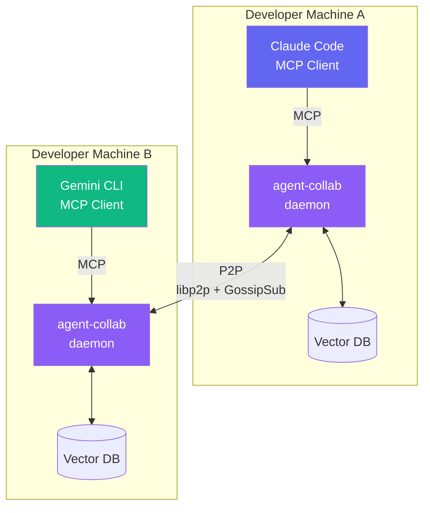
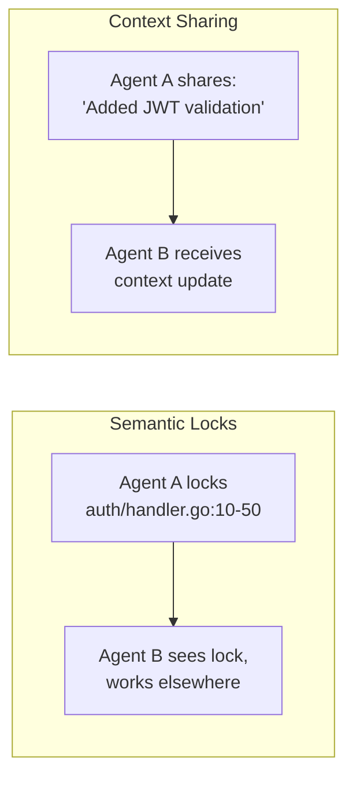

# agent-collab

**P2P distributed collaboration for AI agents**

Share context and coordinate work across your team without a central server.

---

## Why agent-collab?

When multiple AI agents work on the same codebase, conflicts happen. One agent modifies a file while another is analyzing it. Changes get overwritten. Context is lost.

`agent-collab` solves this with:

| Feature | Description |
|---------|-------------|
| **No Server Required** | Direct P2P communication via libp2p |
| **Semantic Locks** | Prevent conflicts with intention-based locking |
| **Context Sharing** | Keep all agents in sync with CRDT-based synchronization |
| **MCP Integration** | Connect Claude Code, Gemini CLI, or any MCP-compatible agent |

## Who Should Use This?

- **Teams using multiple AI agents** on the same codebase
- **Developers with Claude Code + other AI tools** working in parallel
- **Organizations** wanting to coordinate AI-assisted development

## How It Works



### Core Concepts



**Semantic Locks** prevent conflicts by tracking *intent*. Before editing `auth/handler.go`, an agent acquires a lock explaining what it plans to do. Other agents see this and work elsewhere.

**Context Sync** uses CRDTs to share knowledge across the cluster. When one agent learns something about the codebase, all agents benefit.

## Quick Example

```bash
# 1. Start the daemon
agent-collab daemon start

# 2. Create a cluster
agent-collab init -p my-project
# Outputs: Invite token: abc123...

# 3. Connect Claude Code
claude mcp add agent-collab -- agent-collab mcp serve

# Done! Your AI agents can now collaborate.
```

## Next Steps

<div class="grid cards" markdown>

- :material-download: **[Installation](getting-started/installation.md)**

    Install agent-collab on your system

- :material-rocket-launch: **[Quick Start](getting-started/quick-start.md)**

    Get up and running in 5 minutes

- :material-sitemap: **[Architecture](concepts/architecture.md)**

    Understand how agent-collab works

- :material-tools: **[MCP Tools](guide/mcp-tools.md)**

    Learn about available MCP tools

</div>
