# Security

Security considerations and best practices for agent-collab.

## Security Architecture


## Network Security

### P2P Encryption

All peer-to-peer communication is encrypted:


| Protocol | Encryption | Key Exchange |
|----------|-----------|--------------|
| libp2p | TLS 1.3 | Noise Protocol |
| WireGuard (optional) | ChaCha20-Poly1305 | Curve25519 |

### WireGuard VPN (Recommended for Production)

For additional security, enable WireGuard:

```bash
agent-collab init -p secure-project --wireguard
```


**WireGuard benefits:**

- Stronger encryption (ChaCha20-Poly1305)
- Better NAT traversal
- Consistent performance
- Private VPN subnet (10.100.0.0/24 by default)

## Authentication

### Node Identity

Each node has a unique identity:


```bash
# View your node identity
agent-collab status --json | jq '.node_id'
```

### Cluster Authentication

Clusters use invite tokens for authentication:


**Token security best practices:**

!!! warning "Token Handling"
    - Share tokens only through secure channels (encrypted chat, in-person)
    - Tokens contain cluster connection info
    - Regenerate tokens if compromised: `agent-collab token refresh`

## Data Security

### Local Storage

All data is stored locally on each peer:

```mermaid
flowchart TB
    subgraph Storage["~/.agent-collab/"]
        KEY[key.json<br/>🔒 Node identity]
        DB[(badger/<br/>🔒 Local DB)]
        VEC[(vectors/<br/>🔒 Embeddings)]
    end

    note[All files are local<br/>Nothing stored centrally]
```



**Sensitive files:**

| File | Content | Protection |
|------|---------|-----------|
| `key.json` | Node private key | File permissions (600) |
| `badger/` | Locks, agents, config | File permissions |
| `vectors/` | Context embeddings | File permissions |

### File Permissions

```bash
# Recommended permissions
chmod 700 ~/.agent-collab
chmod 600 ~/.agent-collab/key.json
chmod 700 ~/.agent-collab/badger
chmod 700 ~/.agent-collab/vectors
```

### Data in Transit


All data transmitted between peers is encrypted with TLS 1.3.

## API Key Management

### Embedding Provider Keys


**Best practices:**

=== "Environment Variables"

    ```bash
    # Set in shell profile
    export OPENAI_API_KEY="sk-..."
    export ANTHROPIC_API_KEY="sk-ant-..."

    # Or use a secrets manager
    export OPENAI_API_KEY=$(op read "op://Vault/OpenAI/API Key")
    ```

=== "Local Ollama (Most Secure)"

    ```bash
    # No API keys needed - runs locally
    agent-collab config set embedding.provider ollama

    # Ensure Ollama is running
    ollama serve
    ```

!!! danger "Never commit API keys"
    - Don't store API keys in config files
    - Don't include in invite tokens
    - Use environment variables or secrets managers

## Threat Model

### What agent-collab protects against

```mermaid
flowchart TB
    subgraph Protected["Protected Against"]
        T1[Eavesdropping<br/>✓ TLS encryption]
        T2[MITM attacks<br/>✓ Node identity verification]
        T3[Unauthorized access<br/>✓ Invite token auth]
        T4[Data tampering<br/>✓ Signed messages]
    end
```



### What requires additional measures

```mermaid
flowchart TB
    subgraph Additional["Requires Additional Measures"]
        T1[Physical access<br/>→ Disk encryption]
        T2[Malicious peer<br/>→ Trusted networks only]
        T3[Token leakage<br/>→ Secure sharing]
        T4[Key compromise<br/>→ Regular rotation]
    end
```



## Security Recommendations

### For Development


### For Production


**Production checklist:**

- [ ] Enable WireGuard: `agent-collab init -p project --wireguard`
- [ ] Set strict file permissions
- [ ] Use environment variables for API keys
- [ ] Configure firewall to allow only necessary ports
- [ ] Regularly rotate invite tokens
- [ ] Monitor peer connections

## Audit & Compliance

### Event Logging

```bash
# View recent security-relevant events
agent-collab events list --type peer.connected
agent-collab events list --type agent.joined
```

### Data Residency

All data stays on local machines:

| Data Type | Storage Location | External Calls |
|-----------|-----------------|----------------|
| Context | Local Vector DB | Embedding API only |
| Locks | Local BadgerDB | None |
| Config | Local files | None |
| Keys | Local file | None |

!!! info "Embedding API Calls"
    When using external embedding providers (OpenAI, etc.), context text is sent to generate embeddings. Use Ollama for fully local operation.

## Incident Response

### Key Compromise


```bash
# If node key is compromised
agent-collab leave --force
rm ~/.agent-collab/key.json
agent-collab daemon start  # Generates new key
agent-collab join <new-token>
```

### Token Compromise

```bash
# If invite token is compromised
agent-collab token refresh

# Share new token with legitimate users
agent-collab token show
```

### Suspicious Peer

```bash
# Check connected peers
agent-collab peers list

# Ban suspicious peer (if implemented)
agent-collab peers ban <peer-id>

# Or leave and create new cluster
agent-collab leave
agent-collab init -p new-cluster
```
