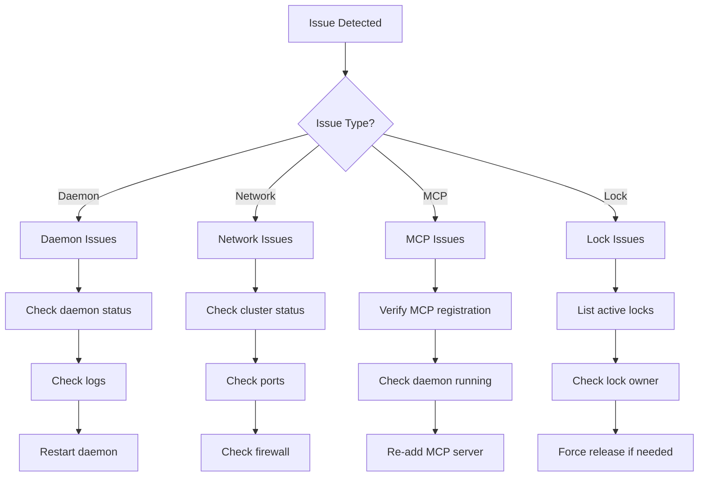
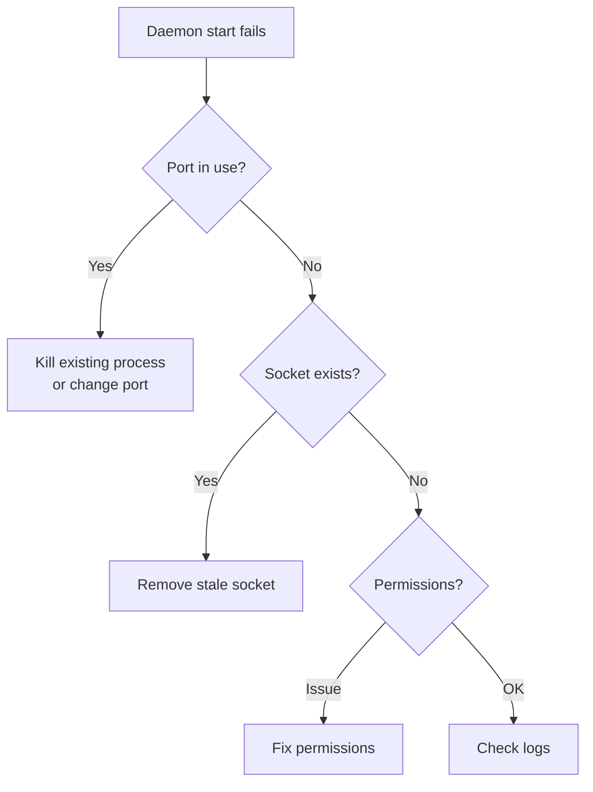
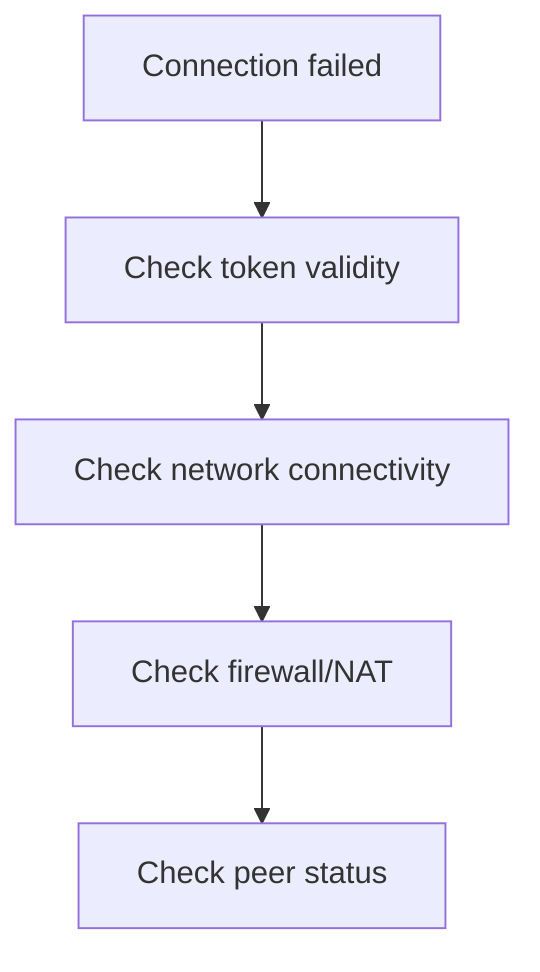
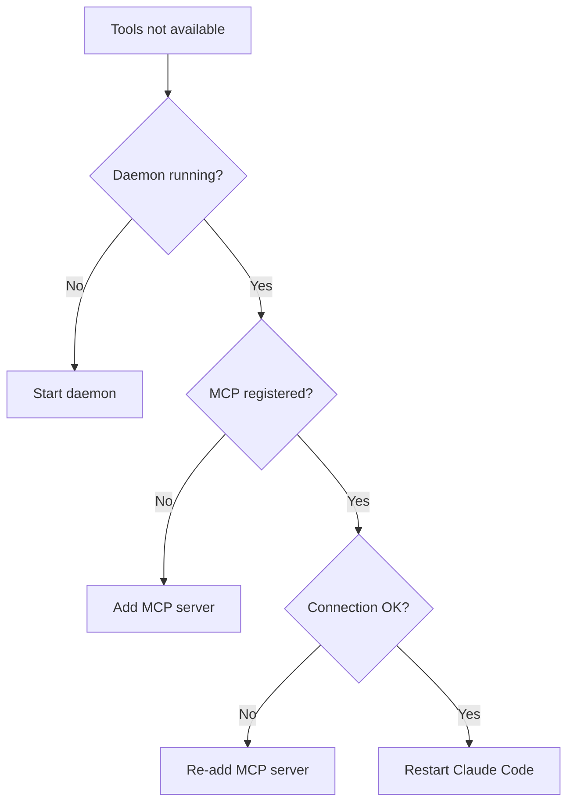
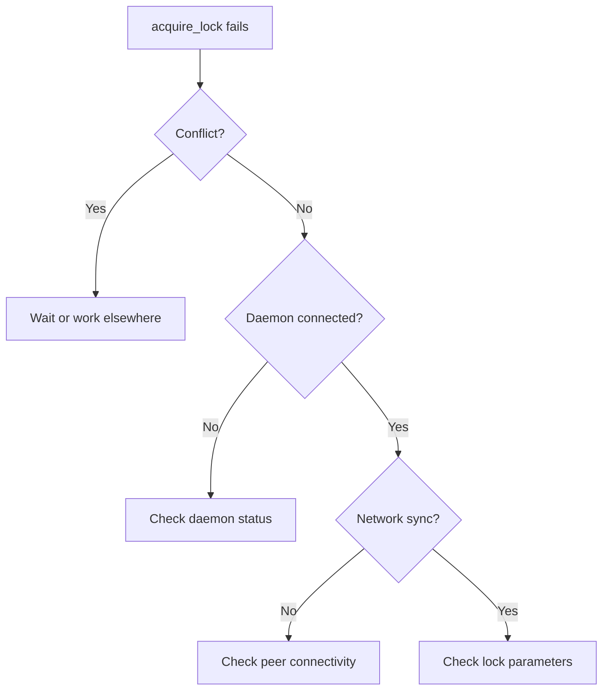
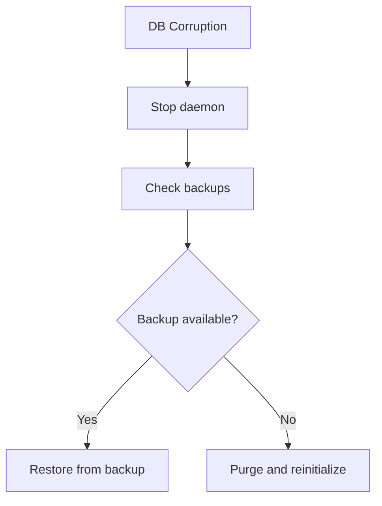
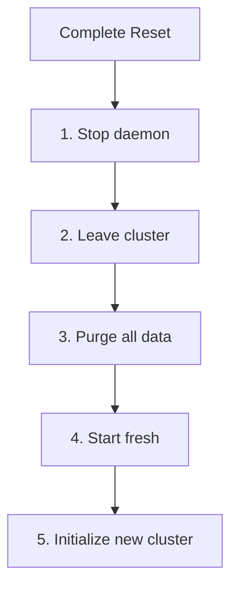

# Troubleshooting

Common issues and how to resolve them.

## Diagnostic Flow



## Daemon Issues

### Daemon Won't Start

**Symptoms:**
```bash
$ agent-collab daemon start
Error: failed to start daemon: address already in use
```

**Diagnosis:**



**Solutions:**

=== "Port Already in Use"

    ```bash
    # Find what's using the port
    lsof -i :4001

    # Kill the process
    kill -9 <PID>

    # Or use a different port
    agent-collab config set network.listen_port 4002
    agent-collab daemon start
    ```

=== "Stale Socket File"

    ```bash
    # Remove stale socket
    rm ~/.agent-collab/daemon.sock

    # Try starting again
    agent-collab daemon start
    ```

=== "Permission Issues"

    ```bash
    # Fix permissions
    chmod 700 ~/.agent-collab
    chmod 600 ~/.agent-collab/*

    agent-collab daemon start
    ```

### Daemon Crashes

**Check the logs:**

```bash
# View daemon status with details
agent-collab daemon status --verbose

# Check system logs (macOS)
log show --predicate 'process == "agent-collab"' --last 1h

# Check system logs (Linux)
journalctl -u agent-collab --since "1 hour ago"
```

**Common causes:**

| Cause | Solution |
|-------|----------|
| Out of memory | Reduce context cache size |
| Database corruption | Run `agent-collab migrate rollback` |
| Network interface issue | Check WireGuard if enabled |

## Network Issues

### Can't Connect to Cluster



**Step-by-step diagnosis:**

```bash
# 1. Check cluster status
agent-collab status

# 2. Check if peers are reachable
agent-collab peers list

# 3. Check network ports
lsof -i :4001

# 4. Test connectivity to a peer
nc -zv <peer-ip> 4001
```

### No Peers Found

**Symptoms:**
```bash
$ agent-collab status
Cluster: my-project
Peers: 0 connected
```

**Solutions:**

=== "Check Firewall"

    ```bash
    # macOS
    sudo /usr/libexec/ApplicationFirewall/socketfilterfw --listapps

    # Linux (ufw)
    sudo ufw status
    sudo ufw allow 4001/tcp
    sudo ufw allow 4001/udp
    ```

=== "Check NAT"

    ```bash
    # If behind NAT, try enabling WireGuard
    agent-collab leave
    agent-collab init -p my-project --wireguard

    # Or configure port forwarding on your router
    # Forward TCP/UDP 4001 to your machine
    ```

=== "Use Bootstrap Peers"

    ```bash
    # Add a known peer as bootstrap
    agent-collab config set network.bootstrap "/ip4/1.2.3.4/tcp/4001/p2p/12D3Koo..."
    agent-collab daemon restart
    ```

### Connection Drops Frequently

**Diagnosis:**

```bash
# Watch connection status
agent-collab status --watch

# Check peer connection history
agent-collab peers list --verbose
```

**Common causes and fixes:**

| Cause | Fix |
|-------|-----|
| Unstable network | Increase heartbeat interval |
| Firewall timeout | Enable keepalive |
| NAT issues | Enable WireGuard |

## MCP Issues

### Tools Not Showing in Claude Code



**Step-by-step fix:**

```bash
# 1. Ensure daemon is running
agent-collab daemon status
# If not running:
agent-collab daemon start

# 2. Check MCP registration
claude mcp list

# 3. Re-add if missing or broken
claude mcp remove agent-collab
claude mcp add agent-collab -- agent-collab mcp serve

# 4. Verify
claude mcp list | grep agent-collab
```

### MCP Connection Timeout

**Symptoms:**
```
Error: MCP server connection timeout
```

**Solutions:**

```bash
# Check if daemon is responding
agent-collab status

# Try standalone mode for debugging
agent-collab mcp serve --standalone

# Check socket file
ls -la ~/.agent-collab/daemon.sock
```

## Lock Issues

### Lock Acquisition Fails



**Common errors:**

=== "Lock Conflict"

    ```bash
    # See who has the lock
    agent-collab lock list

    # Output:
    # ID       File                Lines    Owner           Intention
    # lock-1   auth/handler.go     10-50    claude-abc123   Adding JWT

    # Options:
    # 1. Wait for release
    # 2. Work on different lines
    # 3. Contact the other agent's user
    ```

=== "Invalid Parameters"

    ```bash
    # Ensure valid line range
    # start_line must be <= end_line
    # Lines must be positive integers

    # Example of valid lock
    acquire_lock("file.go", 10, 50, "description")
    ```

### Stale Locks

**Symptoms:** Locks that should have expired are still active.

**Solutions:**

```bash
# List all locks with details
agent-collab lock list --verbose

# Force release a specific lock
agent-collab lock release <lock-id>

# Release all stale locks (use with caution)
agent-collab lock list --stale | xargs -I {} agent-collab lock release {}
```

!!! warning "Force Release"
    Only force-release locks when you're sure the owning agent is disconnected or crashed.

## Database Issues

### Database Corruption

**Symptoms:**
```
Error: badger: checksum mismatch
```

**Recovery:**



```bash
# 1. Stop daemon
agent-collab daemon stop

# 2. Check available backups
agent-collab migrate backups

# 3a. Restore from backup
agent-collab migrate restore --backup <backup-name>

# 3b. Or purge and start fresh
agent-collab data purge --force
agent-collab daemon start
agent-collab init -p my-project
```

### Storage Full

```bash
# Check data usage
agent-collab data info

# Output:
# Data directory: ~/.agent-collab
# Total size: 1.2 GB
# - vectors: 800 MB
# - badger: 350 MB
# - logs: 50 MB

# Clean old data
agent-collab data purge --keep-config
```

## Embedding Issues

### Embedding Provider Errors

**Symptoms:**
```
Error: embedding provider unavailable
```

**Diagnosis:**

```bash
# Check current provider
agent-collab config show | grep embedding

# List available providers
agent-collab agents providers
```

**Solutions:**

=== "API Key Missing"

    ```bash
    # Set the API key
    export OPENAI_API_KEY="sk-..."

    # Or switch to Ollama (no API key needed)
    agent-collab config set embedding.provider ollama
    ```

=== "Provider Unavailable"

    ```bash
    # Check provider status
    curl -I https://api.openai.com/v1/models

    # Switch to fallback provider
    agent-collab config set embedding.provider ollama
    ```

=== "Ollama Not Running"

    ```bash
    # Start Ollama
    ollama serve

    # Pull the embedding model
    ollama pull nomic-embed-text
    ```

## Complete Reset

When all else fails:



```bash
# Nuclear option - complete reset
agent-collab daemon stop
agent-collab leave --force
agent-collab data purge --force

# Start fresh
agent-collab daemon start
agent-collab init -p my-project
```

## Getting Help

If you can't resolve the issue:

1. **Check existing issues:** [GitHub Issues](https://github.com/vanillacake369/agent-collab/issues)
2. **Collect diagnostic info:**
   ```bash
   agent-collab version
   agent-collab daemon status --verbose
   agent-collab status --json
   ```
3. **Open a new issue** with the diagnostic info
