# CLI Reference

Complete command reference for agent-collab.

## Command Overview

```mermaid
flowchart TB
    ROOT[agent-collab] --> CLUSTER[Cluster Commands]
    ROOT --> LOCK[Lock Commands]
    ROOT --> DAEMON[Daemon Commands]
    ROOT --> TOKEN[Token Commands]
    ROOT --> CONFIG[Config Commands]
    ROOT --> AGENTS[Agent Commands]
    ROOT --> PEERS[Peer Commands]
    ROOT --> WG[WireGuard Commands]
    ROOT --> DATA[Data Commands]
    ROOT --> MIGRATE[Migrate Commands]
    ROOT --> MCP[MCP Commands]

    CLUSTER --> init & join & leave & status
    LOCK --> list & release & history
    DAEMON --> start & stop & dstatus[status]
    TOKEN --> show & refresh & usage
    CONFIG --> cshow[show] & set & reset
    AGENTS --> alist[list] & info & providers
    PEERS --> plist[list] & pinfo[info]
    WG --> wgstatus[status] & wgpeers[peers] & support
    DATA --> purge & path & dinfo[info]
    MIGRATE --> mstatus[status] & mstart[start] & rollback & backups & restore
    MCP --> serve & minfo[info]
```



## Global Flags

| Flag | Short | Description |
|------|-------|-------------|
| `--help` | `-h` | Show help |
| `--version` | `-v` | Show version |
| `--config` | `-c` | Config file path |
| `--verbose` | | Enable verbose output |

## Root Command

Running `agent-collab` without arguments starts the TUI dashboard:

```bash
agent-collab
# or with specific tab
agent-collab --tab cluster
agent-collab --tab locks
agent-collab --tab context
agent-collab --tab tokens
agent-collab --tab peers
```

---

## Cluster Commands

### agent-collab init

Create a new cluster.

```bash
agent-collab init -p <project-name> [flags]
```

**Flags:**

| Flag | Short | Default | Description |
|------|-------|---------|-------------|
| `--project` | `-p` | (required) | Project/cluster name |
| `--wireguard` | `-w` | false | Enable WireGuard VPN |
| `--wg-port` | | 51820 | WireGuard listen port |
| `--wg-subnet` | | 10.100.0.0/24 | WireGuard subnet |
| `--foreground` | `-f` | false | Run in foreground |

**Example:**

```bash
# Basic cluster
agent-collab init -p my-project

# With WireGuard
agent-collab init -p secure-project --wireguard --wg-port 51821

# Output:
# ✓ Cluster created: my-project
# ✓ Invite token: <your-invite-token>
```

---

### agent-collab join

Join an existing cluster.

```bash
agent-collab join <invite-token> [flags]
```

**Flags:**

| Flag | Short | Default | Description |
|------|-------|---------|-------------|
| `--name` | `-n` | hostname | Node display name |
| `--foreground` | `-f` | false | Run in foreground |

**Example:**

```bash
agent-collab join <your-invite-token> --name dev-machine-1
```

---

### agent-collab leave

Leave the current cluster.

```bash
agent-collab leave [flags]
```

**Flags:**

| Flag | Short | Default | Description |
|------|-------|---------|-------------|
| `--force` | `-f` | false | Force leave without confirmation |
| `--clean` | | false | Clean local data after leaving |

---

### agent-collab status

Show cluster status.

```bash
agent-collab status [flags]
```

**Flags:**

| Flag | Short | Description |
|------|-------|-------------|
| `--json` | | Output as JSON |
| `--watch` | `-w` | Watch mode (live updates) |

**Example Output:**

```
Cluster: my-project
Node ID: 12D3KooWAbC...
Status: Connected

Peers: 3 connected
  - dev-machine-1 (12D3KooWXyZ...)
  - dev-machine-2 (12D3KooWDeF...)
  - dev-machine-3 (12D3KooWGhI...)

Active Locks: 2
Shared Contexts: 15
Uptime: 2h 34m
```

---

## Lock Commands

### agent-collab lock list

List active locks.

```bash
agent-collab lock list [flags]
```

**Flags:**

| Flag | Description |
|------|-------------|
| `--verbose` | Show detailed lock info |
| `--json` | Output as JSON |
| `--stale` | Show only stale locks |

**Example Output:**

```
┌─────────┬──────────────────────┬───────────┬─────────────────────────┬─────────────────────┐
│ ID      │ File                 │ Lines     │ Intention               │ Owner               │
├─────────┼──────────────────────┼───────────┼─────────────────────────┼─────────────────────┤
│ lock-1  │ auth/handler.go      │ 10-50     │ Adding JWT validation   │ claude-abc123       │
│ lock-2  │ db/connection.go     │ 100-150   │ Fixing connection pool  │ gemini-xyz789       │
└─────────┴──────────────────────┴───────────┴─────────────────────────┴─────────────────────┘
```

---

### agent-collab lock release

Release a lock.

```bash
agent-collab lock release <lock-id>
```

!!! warning
    Only release locks you own or when you're certain the owner is disconnected.

---

### agent-collab lock history

Show recent lock activity.

```bash
agent-collab lock history [flags]
```

Shows the last 10 lock events by default.

---

## Daemon Commands

### agent-collab daemon start

Start the background daemon.

```bash
agent-collab daemon start [flags]
```

**Flags:**

| Flag | Short | Description |
|------|-------|-------------|
| `--foreground` | `-f` | Run in foreground (don't daemonize) |

---

### agent-collab daemon stop

Stop the daemon.

```bash
agent-collab daemon stop
```

---

### agent-collab daemon status

Check daemon status.

```bash
agent-collab daemon status [flags]
```

**Flags:**

| Flag | Description |
|------|-------------|
| `--verbose` | Show detailed status |

**Example Output:**

```
Daemon: Running (PID: 12345)
Socket: ~/.agent-collab/daemon.sock
Uptime: 4h 23m
Memory: 45 MB
```

---

## Token Commands

### agent-collab token show

Display the current cluster invite token.

```bash
agent-collab token show
```

---

### agent-collab token refresh

Generate a new invite token.

```bash
agent-collab token refresh
```

Use this if the current token may have been compromised.

---

### agent-collab token usage

Show API token usage statistics.

```bash
agent-collab token usage [flags]
```

**Flags:**

| Flag | Default | Description |
|------|---------|-------------|
| `--period` | day | Period: day, week, month |
| `--json` | | Output as JSON |

**Example Output:**

```
Token Usage (daily):
  Used: 45,230 / 200,000 tokens
  Remaining: 154,770 tokens
  Reset: in 8h 32m

Breakdown:
  - Embeddings: 42,100 tokens
  - Context sync: 3,130 tokens
```

---

## Config Commands

### agent-collab config show

Display current configuration.

```bash
agent-collab config show
```

**Example Output:**

```yaml
network:
  listen_port: 4001
  bootstrap: []

lock:
  default_ttl: 30s
  heartbeat_interval: 10s

context:
  sync_interval: 5s

token:
  daily_limit: 200000

embedding:
  provider: auto
  model: ""
  base_url: ""

ui:
  theme: dark
```

---

### agent-collab config set

Set a configuration value.

```bash
agent-collab config set <key> <value>
```

**Available keys:**

| Key | Type | Default | Description |
|-----|------|---------|-------------|
| `network.listen_port` | int | 4001 | P2P listen port |
| `network.bootstrap` | []string | [] | Bootstrap peer addresses |
| `lock.default_ttl` | duration | 30s | Lock TTL |
| `lock.heartbeat_interval` | duration | 10s | Heartbeat interval |
| `context.sync_interval` | duration | 5s | Context sync frequency |
| `token.daily_limit` | int | 200000 | Daily token limit |
| `embedding.provider` | string | auto | openai, anthropic, google, ollama, mock |
| `embedding.model` | string | | Model name |
| `embedding.base_url` | string | | Custom API base URL |
| `ui.theme` | string | dark | dark, light |

**Examples:**

```bash
# Change port
agent-collab config set network.listen_port 4002

# Use Ollama
agent-collab config set embedding.provider ollama

# Custom Ollama URL
agent-collab config set embedding.base_url http://localhost:11434
```

---

### agent-collab config reset

Reset configuration to defaults.

```bash
agent-collab config reset [flags]
```

**Flags:**

| Flag | Short | Description |
|------|-------|-------------|
| `--force` | `-f` | Skip confirmation |

---

## Agent Commands

### agent-collab agents list

List connected agents.

```bash
agent-collab agents list
```

**Example Output:**

```
┌─────────────────┬──────────────┬─────────────────────┬────────────┐
│ Agent ID        │ Type         │ Connected At        │ Status     │
├─────────────────┼──────────────┼─────────────────────┼────────────┤
│ claude-abc123   │ claude-code  │ 2024-01-15 10:30    │ Active     │
│ gemini-xyz789   │ gemini-cli   │ 2024-01-15 11:45    │ Active     │
└─────────────────┴──────────────┴─────────────────────┴────────────┘
```

---

### agent-collab agents info

Show agent details.

```bash
agent-collab agents info <agent-id>
```

---

### agent-collab agents providers

List supported AI providers.

```bash
agent-collab agents providers
```

**Example Output:**

```
Supported Embedding Providers:
  - openai (OPENAI_API_KEY required)
  - anthropic (ANTHROPIC_API_KEY required)
  - google (GOOGLE_API_KEY required)
  - ollama (local, no API key)
  - mock (testing only)

Currently using: ollama
```

---

## Peer Commands

### agent-collab peers list

List connected peers.

```bash
agent-collab peers list [flags]
```

**Flags:**

| Flag | Description |
|------|-------------|
| `--verbose` | Show detailed peer info |

---

### agent-collab peers info

Show peer details.

```bash
agent-collab peers info <peer-id>
```

---

## WireGuard Commands

### agent-collab wireguard status

Show WireGuard interface status.

```bash
agent-collab wireguard status
```

**Example Output:**

```
WireGuard: Enabled
Interface: wg-agent-collab
IP: 10.100.0.1/24
Port: 51820
Public Key: abc123...

Peers: 2 connected
```

---

### agent-collab wireguard peers

List WireGuard peers.

```bash
agent-collab wireguard peers
```

---

### agent-collab wireguard support

Check WireGuard support on this system.

```bash
agent-collab wireguard support
```

---

## Data Commands

### agent-collab data purge

Delete all local data.

```bash
agent-collab data purge [flags]
```

**Flags:**

| Flag | Short | Description |
|------|-------|-------------|
| `--force` | `-f` | Skip confirmation |
| `--keep-config` | | Keep configuration |
| `--keep-backups` | | Keep backup files |

!!! danger "Destructive"
    This permanently deletes local data. Make sure you have backups.

---

### agent-collab data path

Show data directory path.

```bash
agent-collab data path
# Output: /Users/you/.agent-collab
```

---

### agent-collab data info

Show data usage information.

```bash
agent-collab data info
```

**Example Output:**

```
Data Directory: ~/.agent-collab
Total Size: 234 MB

Breakdown:
  vectors/   180 MB  (embeddings)
  badger/     50 MB  (database)
  logs/        4 MB  (logs)
```

---

## Migrate Commands

### agent-collab migrate status

Check migration status.

```bash
agent-collab migrate status
```

---

### agent-collab migrate start

Start database migration.

```bash
agent-collab migrate start
```

---

### agent-collab migrate rollback

Rollback last migration.

```bash
agent-collab migrate rollback
```

---

### agent-collab migrate backups

List available backups.

```bash
agent-collab migrate backups
```

---

### agent-collab migrate restore

Restore from backup.

```bash
agent-collab migrate restore --backup <backup-name>
```

---

## MCP Commands

### agent-collab mcp serve

Start the MCP server.

```bash
agent-collab mcp serve [flags]
```

**Flags:**

| Flag | Description |
|------|-------------|
| `--standalone` | Run without daemon connection |

Typically used with Claude Code:

```bash
claude mcp add agent-collab -- agent-collab mcp serve
```

---

### agent-collab mcp info

Show MCP server information.

```bash
agent-collab mcp info
```

---

## Exit Codes

| Code | Meaning |
|------|---------|
| 0 | Success |
| 1 | General error |
| 2 | Invalid arguments |
| 3 | Daemon not running |
| 4 | Network error |
| 5 | Lock conflict |
| 6 | Authentication error |

## Environment Variables

| Variable | Description |
|----------|-------------|
| `AGENT_COLLAB_CONFIG` | Config file path |
| `AGENT_COLLAB_DATA` | Data directory |
| `OPENAI_API_KEY` | OpenAI API key |
| `ANTHROPIC_API_KEY` | Anthropic API key |
| `GOOGLE_API_KEY` | Google AI API key |
| `OLLAMA_HOST` | Ollama server URL |
